# **Clientes Ligeros.**

# **1. Clientes Ligeros Con LTSP/Ubuntu.**

El cliente ligero es un ordenador básico de dimensiones reducidas (1/3 de un PC normal), que realiza todas sus tareas contra otro más potente a través de la red, generalmente un servidor, adquiriendo la capacidad computacional de éste.

El servidor concentra todo el procesamiento y envía respuesta a través de la red a los clientes ligeros. Cada usuario posee una cuenta de acceso que le permite iniciar una sesión en cualquier terminal, dando mayor flexibilidad.

# **2. Preparativos.**

Usaremos 2 MVs para montar clientes ligeros con LTSP.

Para consultar o leer más información ir a su web oficial **[LTSP](http://www.ltsp.org/)**.

# **3. Servidor LTSP.**

## **3.1. Preparar La MV Server.**

Creamos la MV del servidor con dos interfaces de red.

* La primera interfaz será la externa. Estará configurada en VirtualBox como adaptador puente y nos servirá para comunicarnos con Internet. La IP de esta interfaz de red deber ser estática y será 172.18.20.41, la máscara será de clase B, el gateway será 172.18.0.1 y el servidor DNS será 8.8.4.4. El nombre del equipo será hernandez20d y el nombre del dominio será curso1718.

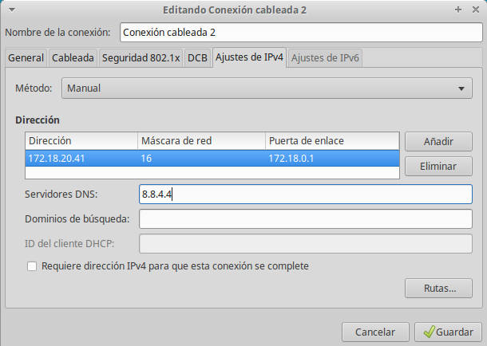

* La segunda interfaz será la interna. Estará configurada en VirtualBox como red interna y nos servírá para conectarnos con los clientes ligeros. La IP de esta interfaz de red debe ser estática y debe estar en la misma red de los clientes, la IP será 192.168.67.1 y la máscara será de clase C.

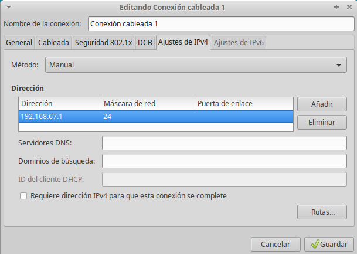

## **3.2. Instalación Del SSOO.**

Instalamos un SO GNU/Linux Xubuntu en la MV del servidor.

Realizamos la siguiente configuración:

~~~
nombre: noelia.
nombre de equipo: hernandez20d.
nombre de usuario: noelia.
nombre de dominio: curso1718.
~~~

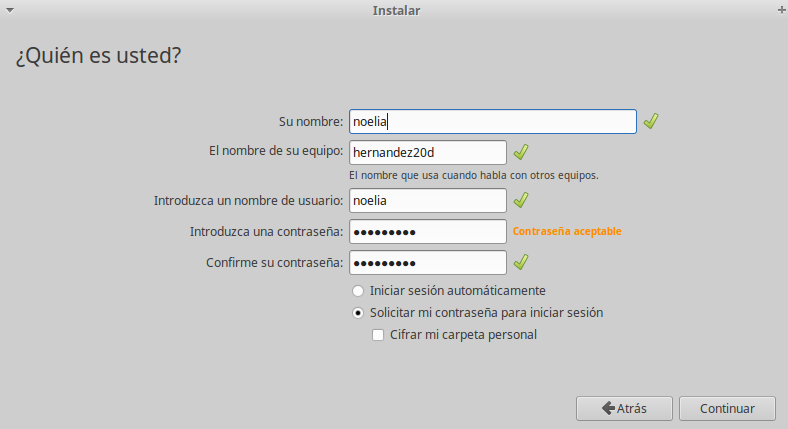

Vamos a los ficheros de configuración de /etc/hostsname y de /etc/hosts y añadimos las líneas que podemos ver a continuación:

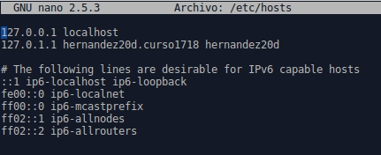

Comprobamos que todo este bien utilizando los siguientes comandos:

~~~
* ip a.
* route -n.
* hostname -a.
* hostname -f.
* uname -a.
* blkid.
~~~

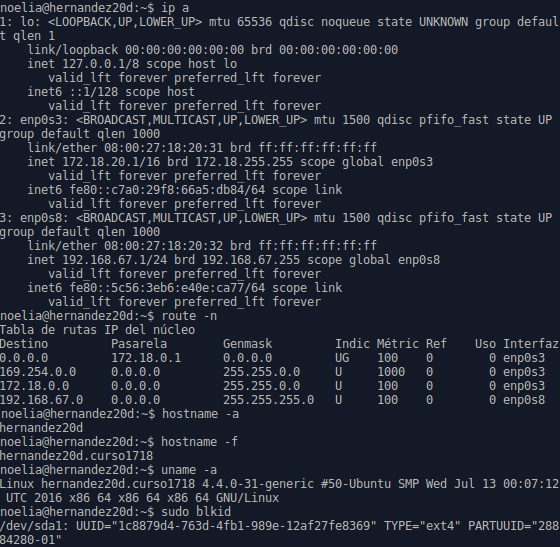

Finalmente creamos tres usuarios locales llamados: hernandez1, hernandez2 y hernandez3.

## **3.3. Instalar El Servicio LTSP.**

Para permitir acceso remoto a la máquina utilizamos el comando apt-get install openssh-server.

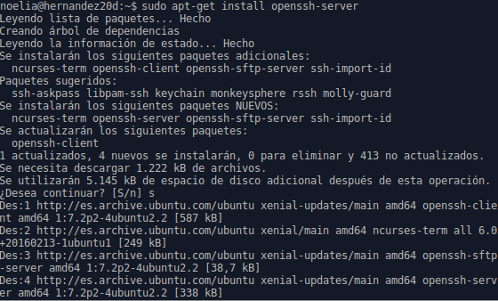

Modificamos el archivo de SSH y cambiamos la línea que pone PermitRootLogin y ponemos Yes.

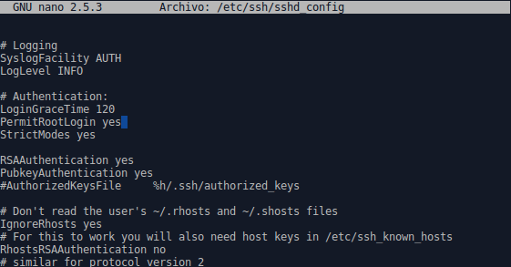

Instalamos el servidor de clientes ligeros, para ello utilizamos el comando apt-get install ltsp-server-standalone.

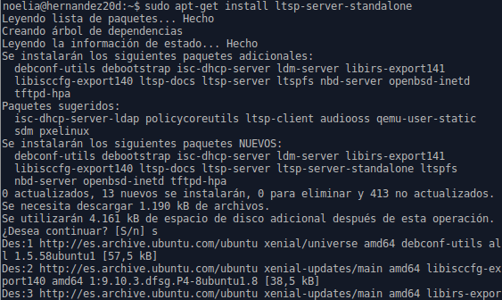

Ahora creamos una imagen del SO utilizando el comando ltsp-build-client, y dicha imagen se cargará en la memoria de los clientes ligeros.

Revisamos la configuración del servicio DHCP instalado junto con LTSP, para ello vamos a consultar el fichero de configuración /etc/ltsp/dhcpd.conf y ahí comprobamos las rutas de option root-path /opt/ltsp/amd64 y filename /ltsp/amd64/pxelinux.0.

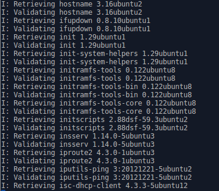

En el fichero /etc/ltsp/dhcpf.conf modificamos el valor de range por 192.168.67.120 192.168.67.220.

Ejecutamos el comando ltsp-info para consultar información sobre nuestra imagen que hemos realizado.

Reiniciamos el servidor y comprobamos que los servicios están corriendo. Para ello utilizamos los comandos ps -ef|grep dhcp y ps -ef|grep ftp.

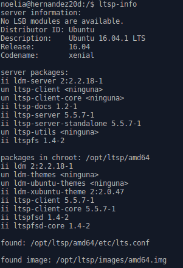

# **4. Preparar MV Cliente.**

Creamos la MV cliente en VirtualBox sin disco duro y sin unidad de DVD, sólo tiene RAM, floppy y la tarjeta de red PXE en modo de red interna.

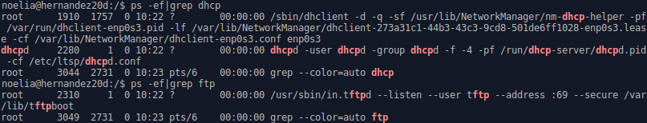

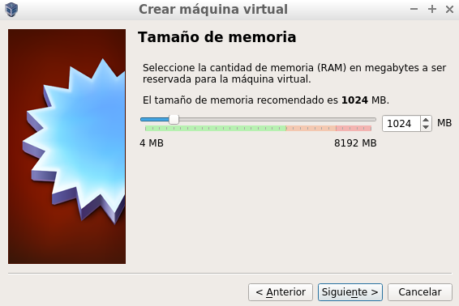

Con el servidor encendido, iniciamos la MV cliente desde red/PXE y comprobamos que funciona pero nos da un error.

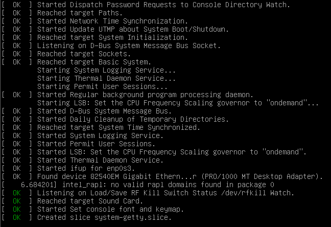

