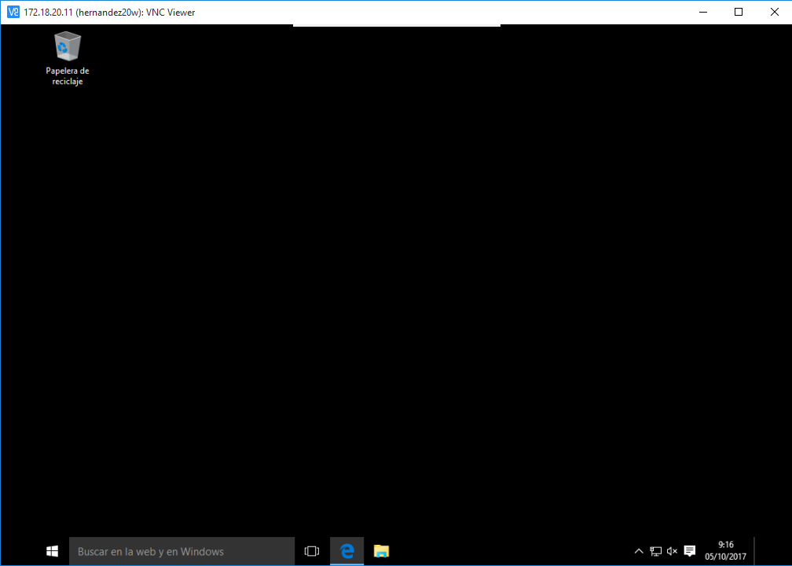
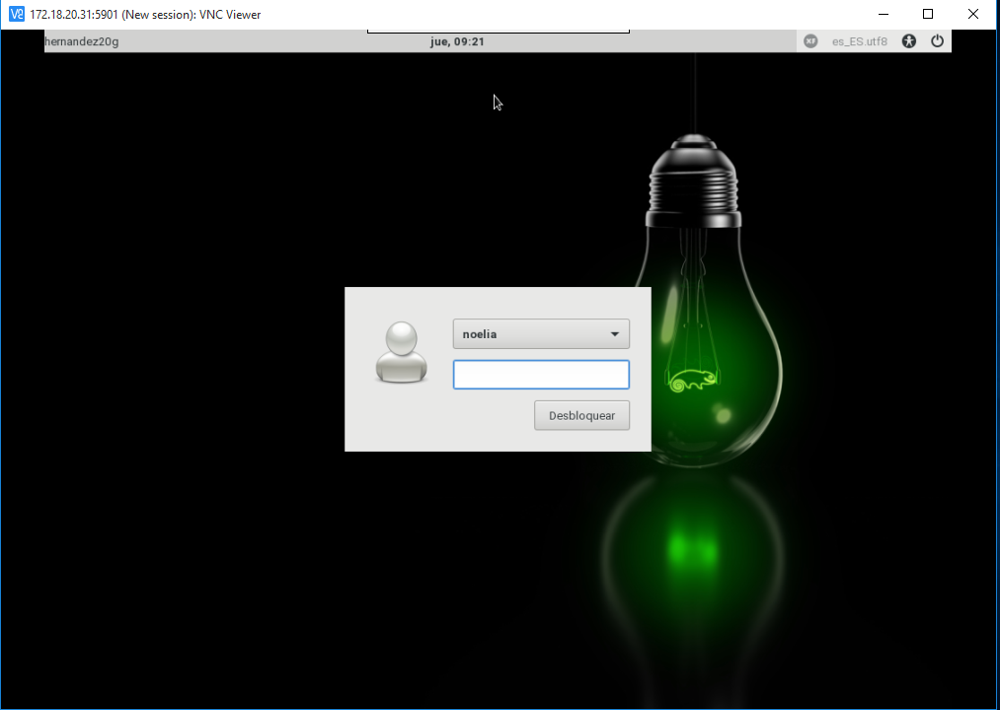
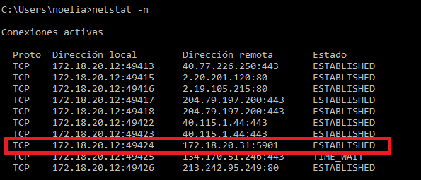

___

# **Acceso Remoto VNC.**

---

# **1. Introducción.**

VNC es un programa de software libre basado en una estructura cliente-servidor que permite tomar el control del ordenador servidor remotamente a través de un ordenador cliente. VNC no impone restricciones en el sistema operativo del ordenador servidor con respecto al del cliente: es posible compartir la pantalla de una máquina con cualquier sistema operativo que admita VNC conectándose desde otro ordenador o dispositivo que disponga de un cliente VNC portado.

___

# **2. Conexiones Remotas Con VNC.**

En esta práctica haremos la instalación y configuración VNC para poder acceder a una máquina remota.

Vamos a realizar las siguientes conexiones remotas VNC:

* Acceder a Windows 10 Server desde Windows 10 Cliente.

* Acceder a GNU/Linux OpenSUSE Leap 42.2 Server desde Windows 10 Cliente.

* Acceder a GNU/Linux OpenSUSE Leap 42.2 Server desde GNU/Linux OpenSUSE Leap 42.2 Cliente.

* Acceder a Windows 10 Server desde GNU/Linux OpenSUSE Leap 42.2 Cliente.

~~~

Para esta práctica usamos conexiones sin cifrar.

~~~

---

# **3. Instalación En Windows.**

Configuramos las máquinas virtuales de Windows 10.

Primero configuramos la máquina virtual de Windows 10 Server.

Ahora configuramos la máquina virtual de Windows 10 Cliente.

TightVNC es una herramienta libre disponible para Windows. En el Servidor VNC usaremos TightVNC Server.

Dicha herramienta necesita una contraseña para luego cuando nos conectemos desde el Windows 10 Cliente poder ponerla y conectarnos de manera segura.

Revisar la configuración del cortafuegos del Servidor VNC Windows para permitir VNC.

En el Cliente usaremos TightVNC Viewer.

## **3.1. Windows Cliente - Windows Server.**

Introducimos la dirección IP del Windows Server y su contraseña, nos hará la conexión y podremos ver lo que pasa en la otra maquina simultáneamente.

Ejecutamos el comando netstat -n desde la máquina del Cliente para ver que se conectan entre ambas máquinas virtuales estableciendo conexiones remotas VNC.

## **3.2. Windows Cliente - OpenSUSE Server.**

Ponemos en la máquina del Cliente Vncviewer 172.18.20.11:5901.

Ejecutamos el comando netstat -n desde la máquina del Cliente para ver que se conectan entre ambas máquinas virtuales estableciendo conexiones remotas VNC.

___

~~~

El comando netstat -n solo se utiliza en las máquinas virtuales de Windows.

~~~

___

# **4. Instalación en OpenSUSE.**

Configuramos las máquinas virtuales de OpenSUSE Leap 42.2.

Primero configuramos la máquina virtual de OpenSUSE Leap 42.2 Server.

Ahora configuramos la máquina virtual de OpenSUSE Leap 42.2 Cliente.

Para ambas máquina ponemos el mismo nombre de usuario, activamos el cortafuegos y ponemos como servicio autorizado el SSH.

En OpenSUSE tenemos el Servidor VNC en el Yast y solo tenemos que activarlo.

Dentro del Servidor VNC tenemos que permitir conexión remota y también abrimos los puertos VNC en el cortafuegos.

Comprobamos también que en el cortafuegos está autorizado el servicio de VNC.

Empezamos la instalación de dicho servicio, instalando los paquetes xorg-x11 y vncmanager.

## **4.1. OpenSUSE Cliente - OpenSUSE Server.**

Vncviewer es un Cliente VNC que viene con OpenSUSE. En la conexión remota, hay que especificar la IP, en mi caso la IP es 5901, para ello utilice el comando nmap -Pn 172.18.20.31, y ahí me sale el número de mi IP.

Ponemos en la máquina del Cliente vncviewer 172.18.20.11:5901.

Ejecutamos el comando netstat -ntap desde la máquina del Cliente para ver que se conectan entre ambas máquinas virtuales estableciendo conexiones remotas VNC.

## **4.2. OpenSUSE Cliente - Windows Server.**

Introducimos la dirección IP del Windows Server.

Ejecutamos el comando netstat -ntap desde la máquina del Cliente para ver que se conectan entre ambas máquinas virtuales estableciendo conexiones remotas VNC.

---

~~~

Hay varias formas de usar Vncviewer:
- vncviewer IP-VNC-Server:590N
- vncviewer IP-VNC-Server:N
- vncviewer IP-VNC-Server::590N

~~~

~~~

El comando netstat -ntap solo se utiliza en las máquinas virtuales de OpenSUSE.

~~~

___
