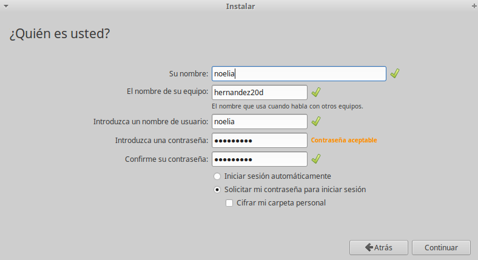
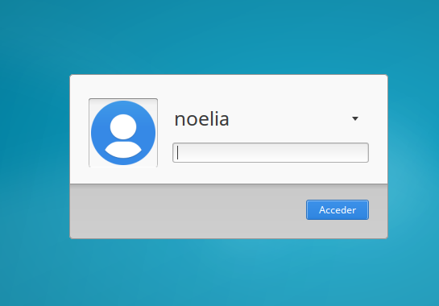
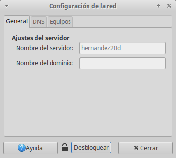
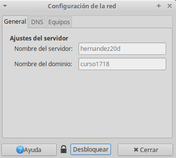
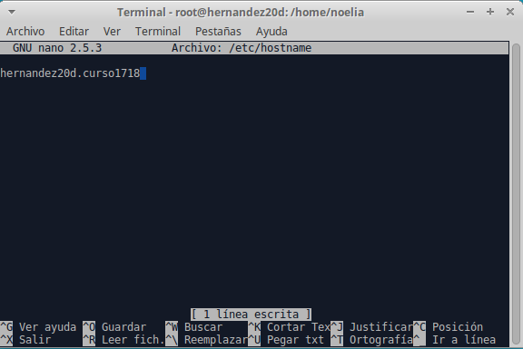
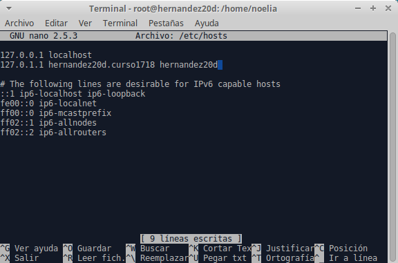

___

# **Acceso Remoto SSH.**

---

# **1. Introducción.**

Vamos a necesitar las siguientes 3 MVs para esta práctica:

* Un servidor GNU/Linux OpenSUSE.
* Un cliente GNU/Linux OpenSUSE.
* Un cliente Windows 7.

___

# **2. Preparativos.**

## **2.1. Servidor SSH.**

Configuramos el servidor GNU/Linux con siguientes valores.

* SO GNU/Linux: OpenSUSE.
* IP estática: 172.18.20.31.
* Nombre de equipo: ssh-server20.

Añadimos en /etc/hosts los equipos ssh-client20a y ssh-client20b.

Para comprobar los cambios ejecutamos varios comandos.

~~~

ip a, comprobamos la IP y la máscara.
route -n, comprobamos la puerta de enlace.
ping 8.8.4.4 -i 2, comprobamos la conectividad externa.
host www.google.es, comprobamos el servidor DNS.
ping ssh-client20a, comprobamos la conectividad con el cliente A.
ping ssh-client20b, comprobamos conectividad con el cliente B.
lsblk, consultamos las particiones.
blkid, consultamos UUID de la instalación.

~~~

Creamos los siguientes usuarios en ssh-server20.

* hernandez1.
* hernandez2.
* hernandez3.
* hernandez4.

## **2.2. Cliente GNU/Linux.**

Configuramos el cliente1 GNU/Linux con los siguientes valores.

* SO OpenSUSE.
* IP estática 172.18.20.32.
* Nombre de equipo: ssh-client20a.

Añadimos en /etc/hosts el equipo ssh-server20, y ssh-client20b.

Comprobamos haciendo ping a ambos equipos.

## **2.3 Cliente Windows.**

Instalamos el software cliente SSH en Windows. Para este ejemplo usaremos PuTTY.

Configuramos el cliente2 Windows con los siguientes valores:

* SO Windows 7.
* IP estática 172.18.20.11.
* Nombre de equipo: ssh-client20b.

Añadimos en C:\Windows\System32\drivers\etc\hosts el equipo ssh-server20 y ssh-client20a.

Comprobamos haciendo ping a ambos equipos.

---

# **3. Instalación Del Servicio SSH.**

Instalamos el servicio SSH en la máquina ssh-server.

Desde terminal zypper search openssh muestra los paquetes instalados o no con nombre openssh*.

Desde terminal zypper install openssh, instala el paquete OpenSSH.

## **3.1 Comprobación.**

Desde el propio ssh-server, verificamos que el servicio está en ejecución. Para ello utilizamos el comando systemctl status sshd, esta es la forma de comprobarlo en systemd.

ps -ef|grep sshd, esta es la forma de comprobarlo mirando los procesos del sistema.

netstat -ntap: Comprobar que el servicio está escuchando por el puerto 22.

## **3.2. Primera Conexión SSH Desde ssh-client20a.**

Comprobamos la conectividad con el servidor desde el cliente con ping ssh-server.

Desde el cliente comprobamos que el servicio SSH es visible con nmap ssh-server. Debe mostrarnos que el puerto 22 está abierto. Primero instalamos el nmap.

Si esto falla debemos comprobar en el servidor la configuración del cortafuegos.

Vamos a comprobar el funcionamiento de la conexión SSH desde cada cliente usando el usuario hernandez1.

Desde el ssh-client1 nos conectamos mediante ssh hernandez1@ssh-server.

 > revisar la imagenes. mirar desde windows cliente.

Si nos volvemos a conectar tendremos.

Comprobamos contenido del fichero $HOME/.ssh/known_hosts en el equipo ssh-client1. OJO si el prompt pone ssh-server están el el servidor, y si pone ssh-client1 están el el cliente1.

¿Te suena la clave que aparece? Es la clave de identificación de la máquina ssh-server.

Una vez llegados a este punto deben de funcionar correctamente las conexiones SSH desde los dos clientes.

---

# **4. ¿Y Si Cambiamos Las Claves Del Servidor?.**

Confirmamos que existen los siguientes ficheros en /etc/ssh, Los ficheros ssh_host*key y ssh_host*key.pub, son ficheros de clave pública/privada que identifican a nuestro servidor frente a nuestros clientes:

Modificamos el fichero de configuración SSH (/etc/ssh/sshd_config) para dejar una única línea: HostKey /etc/ssh/ssh_host_rsa_key. Comentar el resto de líneas con configuración HostKey. Este parámetro define los ficheros de clave publica/privada que van a identificar a nuestro servidor. Con este cambio decimos que sólo vamos a usar las claves del tipo RSA.

## **4.1. Regenerar Certificados.**

Vamos a cambiar o volver a generar nuevas claves públicas/privadas para la identificación de nuestro servidor.

En ssh-server, como usuario root ejecutamos: ssh-keygen -t rsa -f /etc/ssh/ssh_host_rsa_key.

No ponemos password al certificado de la máquina.

Reiniciamos el servicio SSH: systemctl restart sshd.

Comprobamos que el servicio está en ejecución correctamente: systemctl status sshd.

## **4.2. Comprobamos.**

Comprobamos qué sucede al volver a conectarnos desde los dos clientes, usando los usuarios hernandez2 y hernandez1. ¿Qué sucede?

---

# **5. Personalización Del Prompt Bash.**

Podemos añadir las siguientes líneas al fichero de configuración del usuario1 en la máquina servidor (Fichero /home/hernandez1/.bashrc).

~~~
#Se cambia el prompt al conectarse vía SSH

if [ -n "$SSH_CLIENT" ]; then
   PS1="AccesoRemoto_\e[32m\u@\h:\e[0m \w\a\$ "
else
   PS1="\[$(pwd)\]\u@\h:\w>"
fi
~~~

Además, creamos el fichero /home/hernandez1/.alias con el siguiente contenido:

~~~
alias c='clear'
alias g='geany'
alias p='ping'
alias v='vdir -cFl'
alias s='ssh'
~~~

Comprobamos funcionamiento de la conexión SSH desde cada cliente.

---

# **6. Autenticación Mediante Claves Públicas.**

El objetivo de este apartado es el de configurar SSH para poder acceder desde el cliente1, usando el hernandez4 sin poner password, pero usando claves pública/privada.

Para ello, vamos a configurar la autenticación mediante clave pública para acceder con nuestro usuario personal desde el equipo cliente al servidor con el usuario 1er-apellido-alumno4.

Vamos a la máquina ss-client20a.

Iniciamos sesión con nuestro usuario nombre-alumno de la máquina ssh-client20a.

Ejecutamos ssh-keygen -t rsa para generar un nuevo par de claves para el usuario en /home/nuestro-usuario/.ssh/id_rsa y /home/nuestro-usuario/.ssh/id_rsa.pub.

Ahora vamos a copiar la clave pública (id_rsa.pub) del usuario (nombre-de-alumno) de la máquina cliente, al fichero "authorized_keys" del usuario remoto hernandez4 (que está definido en el servidor.

Usamos el comando ssh-copy-id. Ejemplo para copiar la clave pública del usuario actual al usuario remoto en la máquina remota: ssh-copy-id usuario-remoto@hostname-remoto.

Comprobar que ahora al acceder remotamente vía SSH
Desde ssh-clientXXa, NO se pide password.
Desde ssh-clientXXb, SI se pide el password.

---

# **7. Uso De SSH Como Túnel Para X.**

Instalamos en el servidor una aplicación de entorno gráfico (APP1) que no esté en los clientes. Por ejemplo Geany. Si estuviera en el cliente entonces buscar otra aplicación o desinstalarla en el cliente.

Modificamps servidor SSH para permitir la ejecución de aplicaciones gráficas, desde los clientes. Consultar fichero de configuración /etc/ssh/sshd_config (Opción X11Forwarding yes),

Vamos al cliente20a.

Comprobamos que no está instalada APP1: zypper se APP1.

Comprobamos desde el cliente20a, que funciona APP1(del servidor).

Con el comando ssh -X remoteuser1@ssh-server, podemos conectarnos de forma remota al servidor, y ahora ejecutamos APP1 de forma remota.

---

# **8. Aplicaciones Windows Nativas.**

Podemos tener aplicaciones Windows nativas instaladas en ssh-server mediante el emulador WINE.

Instalamos el emulador Wine en el ssh-server.

Ahora podríamos instalar alguna aplicación (APP2) de Windows en el servidor SSH usando el emulador Wine. O podemos usar el Block de Notas que viene con Wine: wine notepad.

Comprobamos el funcionamiento de APP2 en ssh-server.

Comprobamos funcionamiento de APP2, accediendo desde ssh-client1.

___

# **9. Restricciones De Uso.**

Vamos a modificar los usuarios del servidor SSH para añadir algunas restricciones de uso del servicio.
Restricción sobre un usuario

Vamos a crear una restricción de uso del SSH para un usuario:

En el servidor tenemos el usuario remoteuser2. Desde local en el servidor podemos usar sin problemas el usuario.

Vamos a modificar SSH de modo que al usar el usuario por ssh desde los clientes tendremos permiso denegado.

Capturar imagen de los siguientes pasos:

    Consultar/modificar fichero de configuración del servidor SSH (/etc/ssh/sshd_config) para restringir el acceso a determinados usuarios. Consultar las opciones AllowUsers, DenyUsers. Más información en: man sshd_config y en el Anexo de este enunciado.
    Comprobarlo la restricción al acceder desde los clientes.

Restricción sobre una aplicación

Vamos a crear una restricción de permisos sobre determinadas aplicaciones.

    Crear grupo remoteapps
    Incluir al usuario remoteuser4 en el grupo remoteapps.
    Localizar el programa APP1. Posiblemente tenga permisos 755.
    Poner al programa APP1 el grupo propietario a remoteapps.
    Poner los permisos del ejecutable de APP1 a 750. Para impedir que los usurios que no pertenezcan al grupo puedan ejecutar el programa.
    Comprobamos el funcionamiento en el servidor.
    Comprobamos el funcionamiento desde el cliente.

---
