___

# **Acceso Remoto SSH.**

---

# **1. Introducción.**

Vamos a necesitar las siguientes 3 MVs para esta práctica.

* Un Servidor GNU/Linux OpenSUSE.
* Un Cliente GNU/Linux OpenSUSE.
* Un Cliente Windows 7.

___

# **2. Preparativos.**

## **2.1. Servidor SSH.**

Configuramos el Servidor GNU/Linux con siguientes valores.

* SO GNU/Linux: OpenSUSE.
* IP estática: 172.18.20.31.
* Nombre de equipo: ssh-server20.

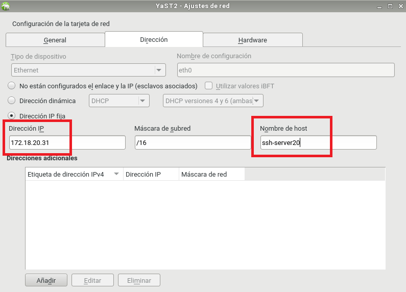

Añadimos en /etc/hosts los equipos ssh-client20a y ssh-client20b.

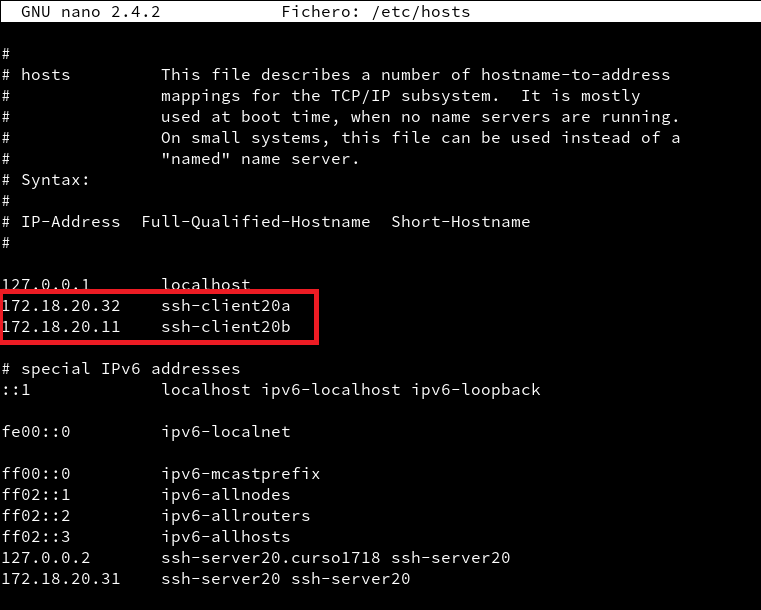

Para comprobar los cambios ejecutamos varios comandos.

~~~

ip a, comprobamos la IP y la máscara.
route -n, comprobamos la puerta de enlace.
ping 8.8.4.4 -i 2, comprobamos la conectividad externa.
host www.google.es, comprobamos el servidor DNS.
ping ssh-client20a, comprobamos la conectividad con el cliente A.
ping ssh-client20b, comprobamos la conectividad con el cliente B.
lsblk, consultamos las particiones.
blkid, consultamos UUID de la instalación.

~~~

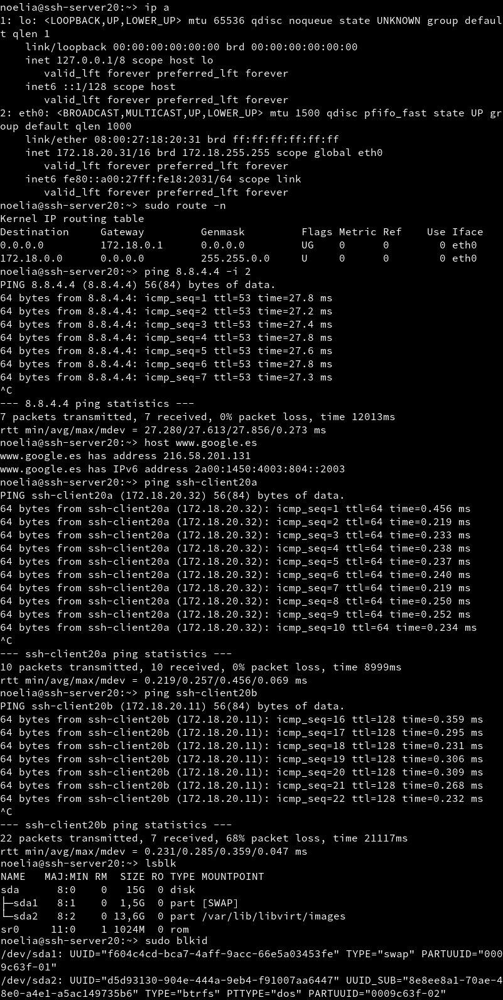

Creamos los siguientes usuarios en ssh-server20.

* hernandez1.
* hernandez2.
* hernandez3.
* hernandez4.

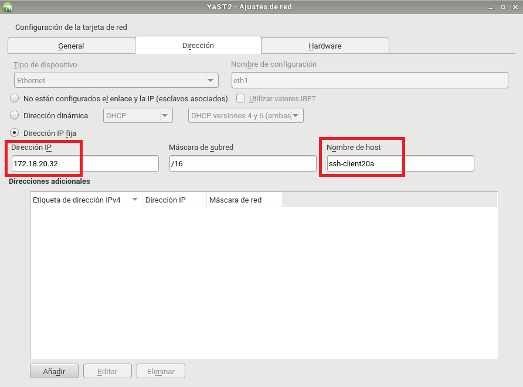

Comprobamos haciendo ping a ambos equipos.

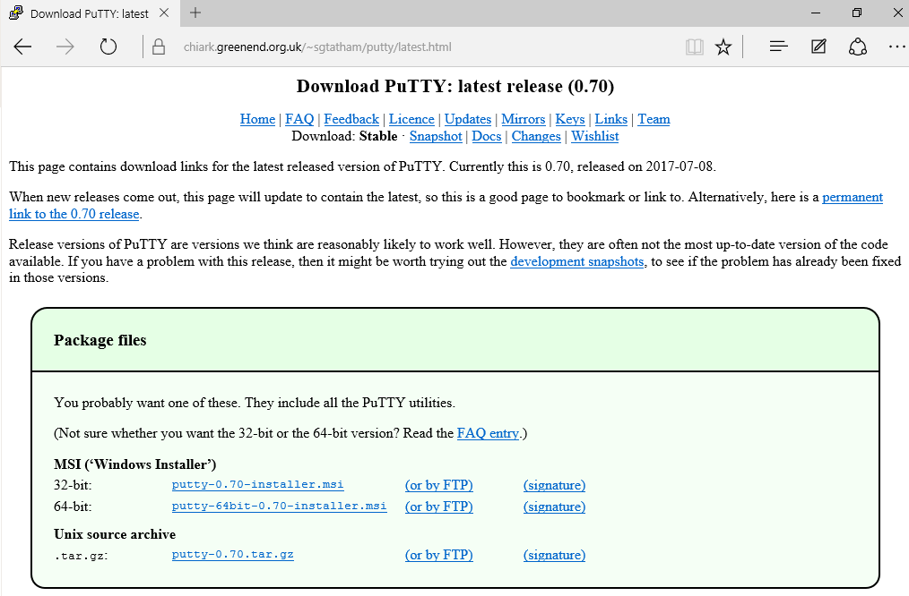

## **2.2. Cliente GNU/Linux.**

Configuramos el cliente1 GNU/Linux con los siguientes valores.

* SO GNU/Linux: OpenSUSE.
* IP estática: 172.18.20.32.
* Nombre de equipo: ssh-client20a.

Añadimos en /etc/hosts los equipos ssh-server20 y ssh-client20b.

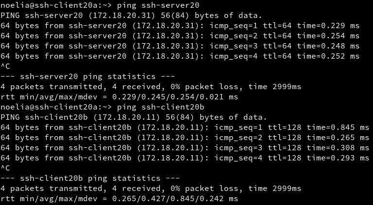

Comprobamos haciendo ping a ambos equipos.

## **2.3 Cliente Windows.**

Instalamos el software cliente SSH en Windows. Para este ejemplo usaremos PuTTY.

Vamos a la página web de [Putty](http://www.putty.org/)

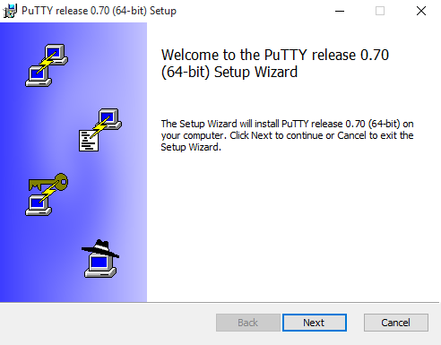

Nos descargamos la versión para Windows.

Empezamos a instalar PuTTY siguiendo las siguientes imagenes.

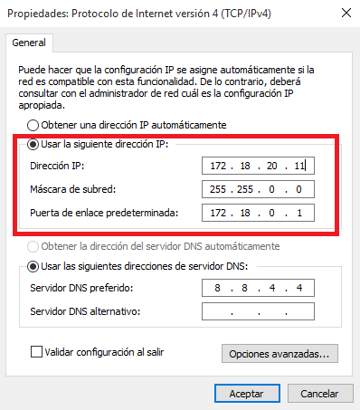

Configuramos el cliente2 Windows con los siguientes valores.

* SO Windows: Windows 7.
* IP estática: 172.18.20.11.
* Nombre de equipo: ssh-client20b.

Añadimos en C:\Windows\System32\drivers\etc\hosts los equipos ssh-server20 y ssh-client20a.

Comprobamos haciendo ping a ambos equipos.

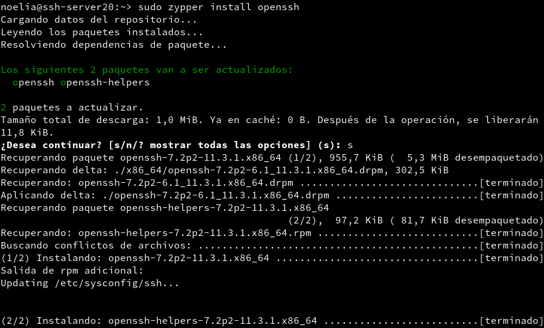

---

# **3. Instalación Del Servicio SSH.**

Instalamos el servicio SSH en la máquina ssh-server.

Para ello vamos a a la terminal y ponemos el comando zypper search openssh y nos mostrara los paquetes instalados o no con nombre openssh*.

Ahora utilizamos el comando zypper install openssh y nos instalara el paquete OpenSSH.

## **3.1 Comprobación.**

Desde el propio ssh-server tenemos que verificar que el servicio está en ejecución. Para ello utilizamos el comando systemctl status sshd.

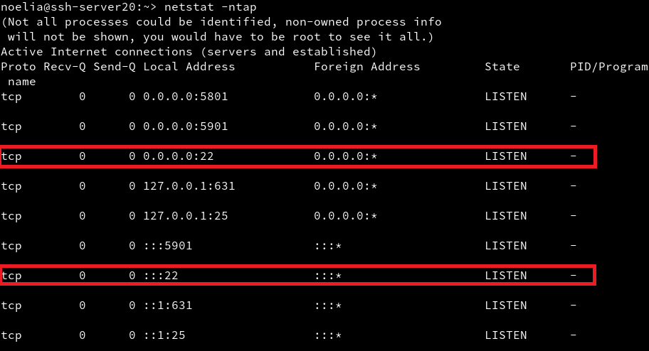

Utilizamos el comando ps -ef | grep sshd para mirar los procesos del sistema.

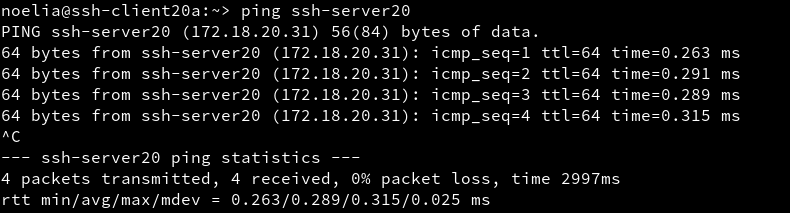

Ahora utilizamos el comando netstat -ntap para comprobar que el servicio está escuchando por el puerto 22.

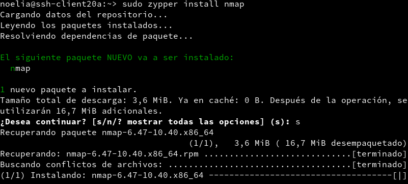

## **3.2. Primera Conexión SSH Desde ssh-client20a.**

Comprobamos la conectividad con el servidor desde el cliente con un ping ssh-server.

Desde el cliente comprobamos que el servicio SSH es visible con el comando nmap ssh-server, al utilizar este comando nos debe mostrar que el puerto 22 está abierto. Primero instalamos el nmap en el cliente20a.

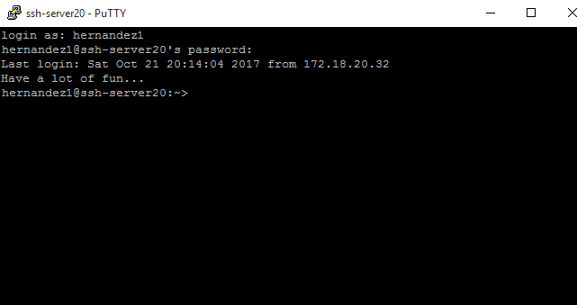

Vamos a comprobar el funcionamiento de la conexión SSH desde cada cliente usando el usuario hernandez1.

Desde el ssh-client1 nos conectamos mediante ssh hernandez1@ssh-server.

Si nos volvemos a conectar tendremos.

Comprobamos el contenido del fichero $HOME/.ssh/known_hosts en el equipo ssh-client1.

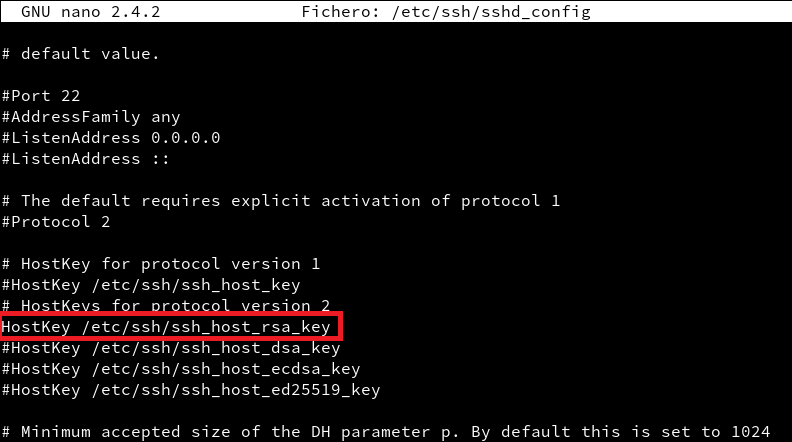

Lo que nos aparece es la clave de identificación de la máquina ssh-server.

Ya llegados a este punto podemos ver que funciionan correctamente las conexiones SSH desde los dos clientes.

---

# **4. ¿Y Si Cambiamos Las Claves Del Servidor?.**

Confirmamos que existen los siguientes ficheros en /etc/ssh, los ficheros ssh_host*key y ssh_host*key.pub, son ficheros de clave pública/privada que identifican a nuestro servidor frente a nuestros clientes.

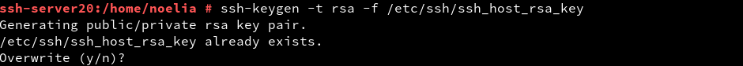

Modificamos el fichero de configuración SSH (/etc/ssh/sshd_config) para dejar una única línea: HostKey /etc/ssh/ssh_host_rsa_key. Comentamos el resto de líneas con configuración HostKey. Este parámetro define los ficheros de clave publica/privada que van a identificar a nuestro servidor. Con este cambio decimos que sólo vamos a usar las claves del tipo RSA.

## **4.1. Regenerar Certificados.**

Vamos a cambiar o volver a generar nuevas claves públicas/privadas para la identificación de nuestro servidor.

En ssh-server, como usuario root ejecutamos el comando ssh-keygen -t rsa -f /etc/ssh/ssh_host_rsa_key.

No ponemos password al certificado de la máquina.

Reiniciamos el servicio SSH con el comando systemctl restart sshd y también comprobamos que el servicio está en ejecución correctamente con el comando systemctl status sshd.

## **4.2. Comprobamos.**

Comprobamos qué sucede al volver a conectarnos desde los dos clientes, usando los usuarios hernandez2 y hernandez1.

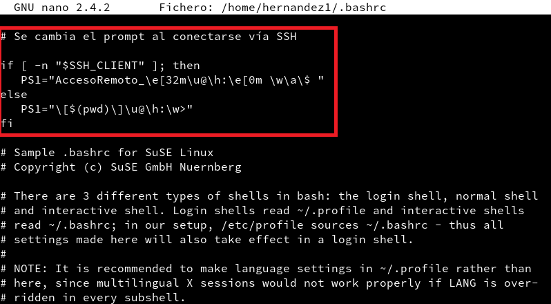

¿Qué sucede?

---

# **5. Personalización Del Prompt Bash.**

Podemos añadir las siguientes líneas al fichero de configuración del usuario1 en la máquina servidor (Fichero /home/hernandez1/.bashrc).

~~~
#Se cambia el prompt al conectarse vía SSH

if [ -n "$SSH_CLIENT" ]; then
   PS1="AccesoRemoto_\e[32m\u@\h:\e[0m \w\a\$ "
else
   PS1="\[$(pwd)\]\u@\h:\w>"
fi
~~~

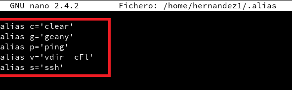

Además, creamos el fichero /home/hernandez1/.alias con el siguiente contenido.

~~~
alias c='clear'
alias g='geany'
alias p='ping'
alias v='vdir -cFl'
alias s='ssh'
~~~

Comprobamos el funcionamiento de la conexión SSH desde cada cliente.

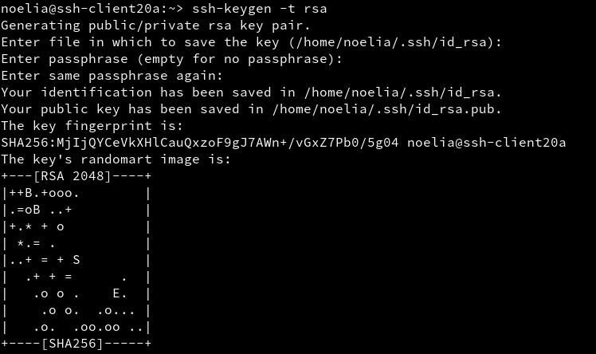

---

# **6. Autenticación Mediante Claves Públicas.**

El objetivo de este apartado es el de configurar SSH para poder acceder desde el cliente1, usando el hernandez4 sin poner password, pero usando claves pública/privada.

Para ello, vamos a configurar la autenticación mediante clave pública para acceder con nuestro usuario personal desde el equipo cliente al servidor con el usuario hernandez4.

Vamos a la máquina ss-client20a.

Iniciamos sesión con nuestro usuario nombre-alumno de la máquina ssh-client20a.

Ejecutamos ssh-keygen -t rsa para generar un nuevo par de claves para el usuario en /home/nuestro-usuario/.ssh/id_rsa y /home/nuestro-usuario/.ssh/id_rsa.pub.

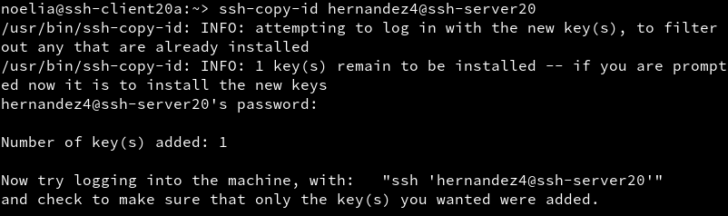

Ahora vamos a copiar la clave pública (id_rsa.pub) del usuario (nombre-de-alumno) de la máquina cliente, al fichero "authorized_keys" del usuario remoto hernandez4 (que está definido en el servidor.

Usamos el comando ssh-copy-id. Ejemplo para copiar la clave pública del usuario actual al usuario remoto en la máquina remota: ssh-copy-id usuario-remoto@hostname-remoto.

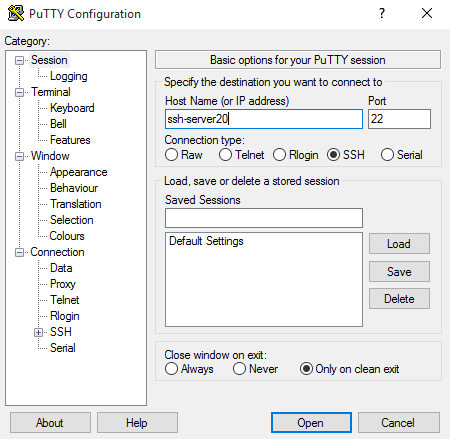

Comprobar que ahora al acceder remotamente vía SSH
Desde ssh-clientXXa, NO se pide password.
Desde ssh-clientXXb, SI se pide el password.

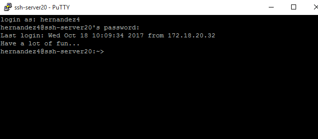

---

# **7. Uso De SSH Como Túnel Para X.**

Instalamos en el servidor una aplicación de entorno gráfico (APP1) que no esté en los clientes. Por ejemplo Geany. Si estuviera en el cliente entonces buscar otra aplicación o desinstalarla en el cliente.

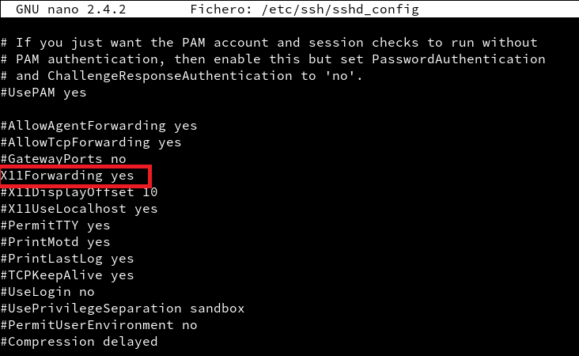

Modificamps servidor SSH para permitir la ejecución de aplicaciones gráficas, desde los clientes. Consultar fichero de configuración /etc/ssh/sshd_config (Opción X11Forwarding yes),

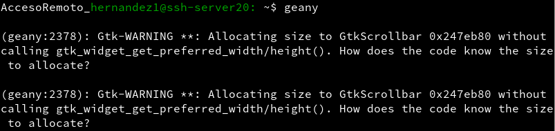

Vamos al cliente20a.

Comprobamos que no está instalada APP1: zypper se APP1.

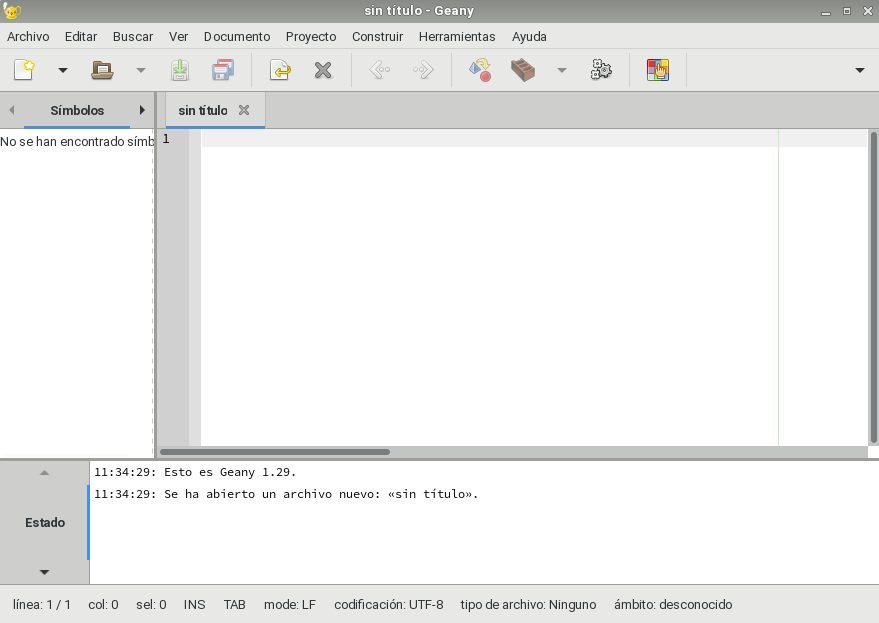

Comprobamos desde el cliente20a, que funciona APP1(del servidor).
Con el comando ssh -X remoteuser1@ssh-server, podemos conectarnos de forma remota al servidor, y ahora ejecutamos APP1 de forma remota.

---

# **8. Aplicaciones Windows Nativas.**

Podemos tener aplicaciones Windows nativas instaladas en ssh-server mediante el emulador WINE.

Instalamos el emulador Wine en el ssh-server.

Ahora podríamos instalar alguna aplicación (APP2) de Windows en el servidor SSH usando el emulador Wine. O podemos usar el Block de Notas que viene con Wine: wine notepad.

Comprobamos el funcionamiento de APP2 en ssh-server.

Comprobamos funcionamiento de APP2, accediendo desde ssh-client1.

___

# **9. Restricciones De Uso.**

Vamos a modificar los usuarios del servidor SSH para añadir algunas restricciones de uso del servicio.

## **9.1. Restricción Sobre Un Usuario.**

Vamos a crear una restricción de uso del SSH para un usuario.

En el servidor tenemos el usuario hernandez2. Desde local en el servidor podemos usar sin problemas el usuario.

Vamos a modificar SSH de modo que al usar el usuario por ssh desde los clientes tendremos permiso denegado.

Consultamos o modificamos el fichero de configuración del servidor SSH (/etc/ssh/sshd_config) para restringir el acceso a determinados usuarios.

Consultamos las opciones AllowUsers, DenyUsers, para ello vamos a la terminal y ponemos el comando man sshd_config y buscamos AllowUsers y DenyUsers.

Comprobamos la restricción al acceder desde los clientes.

## **9.2. Restricción Sobre Una Aplicación.**

Vamos a crear una restricción de permisos sobre determinadas aplicaciones.

Creamos un grupo remoteapps e incluimos al usuario hernandez4 en el grupo remoteapps.

Localizamos el programa APP1. Posiblemente tenga permisos 755.

Ponemos al programa APP1 el grupo propietario a remoteapps.

Ponemos los permisos del ejecutable de APP1 a 750. Para impedir que los usurios que no pertenezcan al grupo puedan ejecutar el programa.

Comprobamos el funcionamiento en el servidor.

Comprobamos el funcionamiento desde el cliente.

---
