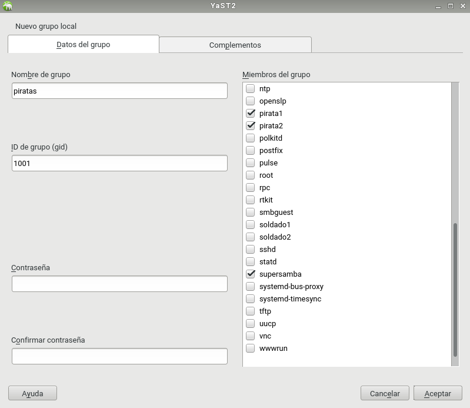
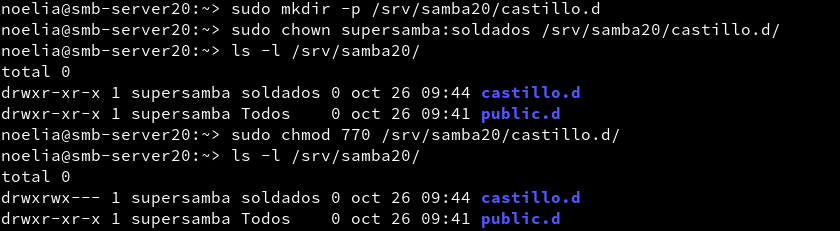
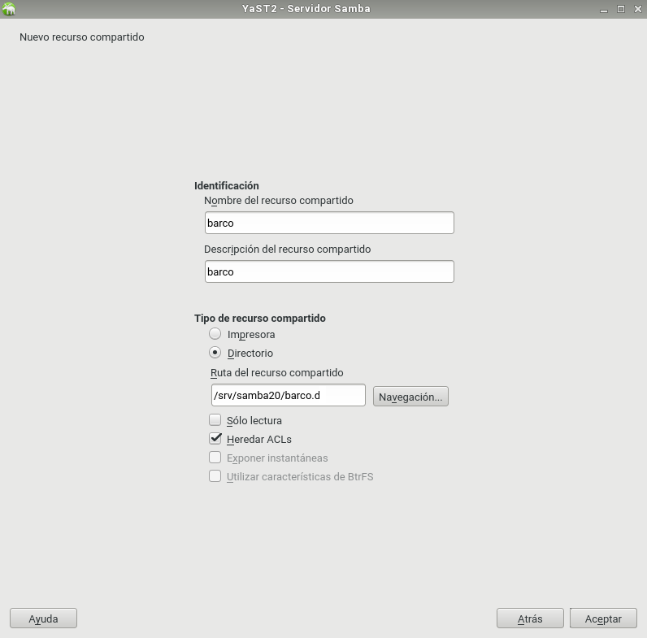

___

# **Recursos SMB/CIFS (OpenSUSE).**

Samba con OpenSUSE y Windows 10.

---

# **1. Introducción.**

Vamos a necesitar las siguientes 3 MVs.

* MV1: Un Servidor GNU/Linux OpenSUSE con IP estática, 172.18.20.31.
* MV2: Un Cliente GNU/Linux OpenSUSE con IP estática, 172.18.20.32.
* MV3: Un Cliente Windows 10 con IP estática, 172.18.20.11.

---

# **2. Servidor Samba (MV1).**

## **2.1. Preparativos.**

Configuramos el Servidor GNU/Linux. Usamos los siguientes valores.

* Nombre de equipo: smb-server20.
* Añadimos en /etc/hosts los equipos smb-cli20a y smb-cli20b.

Capturamos la salida de los comandos siguientes en el Servidor.

~~~
hostname -f.
ip a.
lsblk.
sudo blkid.
~~~

---

## **2.2. Usuarios Locales.**

En este caso utilizare entorno gráfico Yast.

Vamos a GNU/Linux, y creamos los siguientes grupos y usuarios.

Creamos el usuario supersamba.

Creamos los usuarios pirata1, pirata2, luego creamos el grupo piratas y incluimos estos dos usuarios y también supersamba dentro del grupo.

Creamos los usuarios soldado1 y soldado2, luego creamos el grupo soldados y incluimos estos dos usuarios y también supersamba dentro del grupo.

Creamos el usuario smbguest. Para asegurarnos que nadie puede usar smbguest para entrar en nuestra máquina mediante login, vamos a modificar este usuario y le ponemos como shell /bin/false.

Creamos el grupo todos y dentro de este grupo ponemos a todos los usuarios soldados, pitatas, supersamba y a smbguest.

## **2.3. Crear Las Carpetas Para Los Futuros Recursos Compartidos.**

Vamos a crear las carpetas de los recursos compartidos con los permisos siguientes.

* /srv/samba20/public.d
 Usuario propietario supersamba.
 Grupo propietario todos.
 Poner permisos 775.

 

 

* /srv/samba20/castillo.d
  Usuario propietario supersamba.
  Grupo propietario soldados.
  Poner permisos 770.

  

* /srv/samba20/barco.d
  Usuario propietario supersamba.
  Grupo propietario piratas.
  Poner permisos 770.

  

## **2.4. Instalar Samba Server.**

Vamos a hacer una copia de seguridad del fichero de configuración existente cp /etc/samba/smb.conf /etc/samba/smb.conf.000.

Podemos usar comandos o el entorno gráfico para instalar y configurar el servicio Samba. Como estamos en OpenSUSE vamos a usar Yast.

    Yast -> Samba Server
        Workgroup: mar1718
        Sin controlador de dominio.

    En la pestaña de Inicio definimos
        Iniciar el servicio durante el arranque de la máquina.
        Ajustes del cortafuegos -> Abrir puertos

## **2.5. Configurar El Servidor Samba.**

Vamos a configurar los recursos compartido del servidor Samba. Podemos hacerlo modificando el fichero de configuración o por entorno gráfico con Yast. Para ellos vamos a Yast -> Samba Server -> Recursos Compartidos.

~~~
[global]
  netbios name = smb-serverXX
  workgroup = mar1617
  server string = Servidor de nombre-alumno-XX
  security = user
  map to guest = bad user
  guest account = smbguest

[cdrom]
  path = /dev/cdrom
  guest ok = yes
  read only = yes

[public]
  comment = public de nombre-alumno-XX
  path = /srv/sambaXX/public.d
  guest ok = yes
  read only = yes

[castillo]
  comment = castillo de nombre-alumno-XX
  path = /srv/sambaXX/castillo.d
  read only = no
  valid users = @soldados

[barco]
  comment = barco de nombre-alumno-XX
  path = /srv/sambaXX/barco.d
  read only = no
  valid users = pirata1, pirata2
~~~

Abrimos una consola para comprobar los resultados.

* cat /etc/samba/smb.conf

* testparm

## **2.6. Usuarios Samba.**

Después de crear los usuarios en el sistema, hay que añadirlos a Samba.

    smbpasswd -a nombreusuario, para crear clave de Samba para un usuario del sistema.

    pdbedit -L, para comprobar la lista de usuarios Samba.

## **2.7. Reiniciar.**

Ahora que hemos terminado con el servidor, hay que reiniciar el servicio para que se lean los cambios de configuración.

Usamos los comandos.
        Servicio smb
            systemctl stop smb
            systemctl start smb
            systemctl status smb

        Servicio nmb
            systemctl stop nmb
            systemctl start nmb
            systemctl status nmb

    Capturar imagen de los siguientes comando de comprobación:

    sudo testparm     # Verifica la sintaxis del fichero de configuración del servidor Samba

    sudo netstat -tap # Vemos que el servicio SMB/CIF está a la escucha

    Comprobar CORTAFUEGOS

    Para descartar un problema con el cortafuegos del servidor Samba. Probamos el comando nmap -Pn smb-serverXX desde la máquina real, u otra máquina GNU/Linux. Deberían verse los puertos SMB/CIFS(139 y 445) abiertos.

---

# **3. Windows (MV3 smb-cli20b).**

Configurar el cliente Windows.

Usar nombre smb-cli20b y la IP que hemos establecido.
C:\Windows\System32\drivers\etc\hosts
Configurar el fichero ...\etc\hosts de Windows.

En los clientes Windows el software necesario viene preinstalado.

## **3.1. Cliente Windows GUI.**

Desde un cliente Windows vamos a acceder a los recursos compartidos del servidor Samba.

samba-win7-cliente-gui

Comprobar los accesos de todas las formas posibles. Como si fuéramos:

* un soldado

* un pirata

* y/o un invitado.

Después de cada conexión se quedan guardada la información en el cliente Windows. net use * /d /y, para cerrar las conexión SMB/CIFS que se ha realizado desde el cliente al servidor.

Capturar imagen de los siguientes comandos para comprobar los resultados:

smbstatus, desde el servidor Samba.

netstat -ntap, desde el servidor Samba.

netstat -n, desde el cliente Windows.

## **3.2. Cliente Windows Comandos.**

En el cliente Windows, para consultar todas las conexiones/recursos conectados hacemos C:>net use.

Si hubiera alguna conexión abierta la cerramos.
        net use * /d /y, para cerrar las conexiones SMB.
        net use ahora vemos que NO hay conexiones establecidas.

Abrir una shell de windows. Usar el comando net use /?, para consultar la ayuda del comando.

Vamos a conectarnos desde la máquina Windows al servidor Samba usando el comando net.

Con el comando net view, vemos las máquinas (con recursos CIFS) accesibles por la red.

## **3.3. Montaje Automático.**

El comando net use S: \\ip-servidor-samba\recurso /USER:clave establece una conexión del rescurso panaderos y lo monta en la unidad S.

Ahora podemos entrar en la unidad S ("s:") y crear carpetas, etc.

Capturar imagen de los siguientes comandos para comprobar los resultados:
smbstatus, desde el servidor Samba.
netstat -ntap, desde el servidor Samba.
netstat -n, desde el cliente Windows.

~~~

2.2 Cliente Windows comandos

    En el cliente Windows, para consultar todas las conexiones/recursos conectados hacemos C:>net use.
    Si hubiera alguna conexión abierta la cerramos.
        net use * /d /y, para cerrar las conexiones SMB.
        net use ahora vemos que NO hay conexiones establecidas.

Capturar imagen de los comandos siguientes:

    Con el comando net view, vemos las máquinas (con recursos CIFS) accesibles por la red.
    Abrir una shell de windows. Usar el comando net use /?, para consultar la ayuda del comando.
    El comando net use S: \\ip-servidor-samba\recurso clave /USER:usuario /p:yes establece una conexión con el recurso compartido y lo monta en la unidad S. Probemos a montar el recurso barco.

    Con la opción /p:yes hacemos el montaje persistente. De modo que se mantiene en cada reinicio de mñaquina.

    net use, comprobamos.

    Ahora podemos entrar en la unidad S ("s:") y crear carpetas, etc.

    Capturar imagen de los siguientes comandos para comprobar los resultados:
        smbstatus, desde el servidor Samba.
        netstat -ntap, desde el servidor Samba.
        netstat -n, desde el cliente Windows.

~~~
---

# **4. Cliente GNU/Linux (MV2 smb-cli20a).**

Configurar el cliente GNU/Linux.
Usar nombre smb-cli20a y la IP que hemos establecido.
Configurar el fichero /etc/hosts de la máquina.

## **4.1. Cliente GNU/Linux GUI.**

Desde en entorno gráfico, podemos comprobar el acceso a recursos compartidos SMB/CIFS.

Estas son algunas herramientas:

Yast en OpenSUSE

Ejemplo accediendo al recurso prueba del servidor Samba, pulsamos CTRL+L y escribimos smb://ip-del-servidor-samba:

En el momento de autenticarse para acceder al recurso remoto, poner en Dominio el nombre-netbios-del-servidor-samba.

Capturar imagen de lo siguiente:

Probar a crear carpetas/archivos en castillo y en barco.

    Comprobar que el recurso public es de sólo lectura.

Capturar imagen de los siguientes comandos para comprobar los resultados:
smbstatus, desde el servidor Samba.
netstat -ntap, desde el servidor Samba.
netstat -n, desde el cliente.

## **4.2. Cliente GNU/Linux Comandos.**

Existen comandos (smbclient, mount , smbmount, etc.) para ayudarnos a acceder vía comandos al servidor Samba desde el cliente. Puede ser que con las nuevas actualizaciones y cambios de las distribuciones alguno haya cambiado de nombre. ¡Ya lo veremos!

Vamos a un equipo GNU/Linux que será nuestro cliente Samba. Desde este equipo usaremos comandos para acceder a la carpeta compartida.

Primero comprobar el uso de las siguientes herramientas:

sudo smbtree                       # Muestra todos los equipos/recursos de la red SMB/CIFS
                                   # Hay que abrir el cortafuegos para que funcione.
smbclient --list ip-servidor-samba # Muestra los recursos SMB/CIFS de un equipo concreto

Ahora crearemos en local la carpeta /mnt/sambaXX-remoto/corusant.
MONTAJE: Con el usuario root, usamos el siguiente comando para montar un recurso compartido de Samba Server, como si fuera una carpeta más de nuestro sistema: mount -t cifs //172.18.XX.55/castillo /mnt/sambaXX-remoto/castillo -o username=soldado1

En versiones anteriores de GNU/Linux se usaba el comando smbmount //smb-serverXX/public /mnt/remotoXX/public/ -o -username=smbguest.

COMPROBAR: Ejecutar el comando df -hT. Veremos que el recurso ha sido montado.

samba-linux-mount-cifs

        Si montamos la carpeta de castillo, lo que escribamos en /mnt/remotoXX/castillo debe aparecer en la máquina del servidor Samba. ¡Comprobarlo!
        Para desmontar el recurso remoto usamos el comando umount.

    Capturar imagen de los siguientes comandos para comprobar los resultados:
        smbstatus, desde el servidor Samba.
        netstat -ntap, desde el servidor Samba.
        netstat -n, desde el cliente Windows.

## **4.3. Montaje Automático.**

Acabamos de acceder a los recursos remotos, realizando un montaje de forma manual (comandos mount/umount). Si reiniciamos el equipo cliente, podremos ver que los montajes realizados de forma manual ya no están (df -hT). Si queremos volver a acceder a los recursos remotos debemos repetir el proceso de montaje manual, a no ser que hagamos una configuración de montaje permanente o automática.

    Para configurar acciones de montaje automáticos cada vez que se inicie el equipo, debemos configurar el fichero /etc/fstab. Veamos un ejemplo:

----------------------------------------------------------------------------------------

//smb-serverXX/public /mnt/remotoXX/public cifs username=soldado1,password=clave 0 0

    Reiniciar el equipo y comprobar que se realiza el montaje automático al inicio.
    Incluir contenido del fichero /etc/fstab en la entrega.

---

# **5. Preguntas Para Resolver.**

* ¿Las claves de los usuarios en GNU/Linux deben ser las mismas que las que usa Samba?.

* ¿Puedo definir un usuario en Samba llamado soldado3, y que no exista como usuario del sistema?.

* ¿Cómo podemos hacer que los usuarios soldado1 y soldado2 no puedan acceder al sistema pero sí al samba? (Consultar /etc/passwd).

* Añadir el recurso [homes] al fichero smb.conf según los apuntes. ¿Qué efecto tiene?

---
