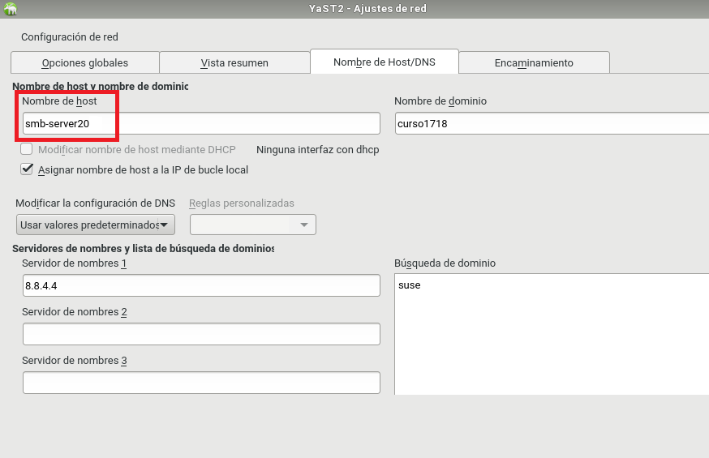
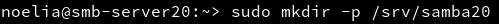
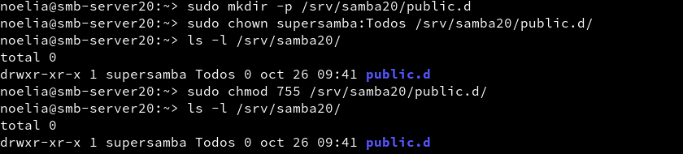
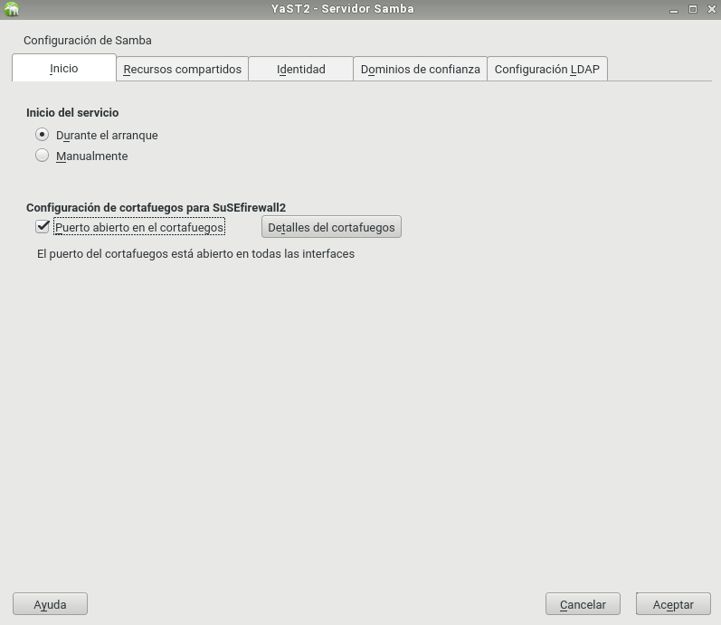

___

# **Samba.**

Samba con OpenSUSE y Windows 10.

---

# **1. Introducción.**

Vamos a necesitar las siguientes 3 MVs.

* MV1: Un Servidor GNU/Linux OpenSUSE con IP estática, 172.18.20.31.
* MV2: Un Cliente GNU/Linux OpenSUSE con IP estática, 172.18.20.32.
* MV3: Un Cliente Windows con IP estática, 172.18.20.11.

---

# **2. Servidor Samba (MV1).**

## **2.1. Preparativos.**

Configuramos el Servidor GNU/Linux. Usamos los siguientes valores.

* Nombre de equipo: smb-server20.

* Añadimos en /etc/hosts los equipos smb-cli20a y smb-cli20b.

Capturamos la salida de los comandos siguientes en el Servidor.

~~~
hostname -f.
ip a.
lsblk.
sudo blkid.
~~~

## **2.2. Usuarios Locales.**

Podemos usar comandos o entorno gráfico Yast, en mi caso utilizare entorno gráfico Yast.

Vamos a GNU/Linux, y creamos los siguientes grupos y usuarios.

Creamos el usuario supersamba.

Creamos los usuarios pirata1, pirata2, luego creamos el grupo piratas y incluimos estos dos usuarios y también supersamba dentro del grupo.

Creamos los usuarios soldado1 y soldado2, luego creamos el grupo soldados y incluimos estos dos usuarios y también supersamba dentro del grupo.

Creamos el usuario smbguest. Para asegurarnos que nadie puede usar smbguest para entrar en nuestra máquina mediante login, vamos a modificar este usuario y le ponemos como shell /bin/false.

Creamos el grupo todos y dentro de este grupo ponemos a todos los usuarios soldados, pitatas, supersamba y a smbguest.

> Ahora añadimos todos los usuarios de Samba al grupo cdrom.  <-- FALTA.

## **2.3. Crear Las Carpetas Para Los Futuros Recursos Compartidos.**

Vamos a crear las carpetas de los recursos compartidos con los permisos siguientes.

* /srv/samba20/public.d
 Usuario propietario: supersamba.
 Grupo propietario: Todos.
 Permisos: 775.

* /srv/samba20/castillo.d
  Usuario propietario: supersamba.
  Grupo propietario: soldados.
  Permisos: 770.

* /srv/samba20/barco.d
  Usuario propietario: supersamba.
  Grupo propietario: piratas.
  Permisos: 770.

## **2.4. Instalar Samba Server.**

Vamos a hacer una copia de seguridad del fichero de configuración existente cp /etc/samba/smb.conf /etc/samba/smb.conf.000.

Podemos usar comandos o el entorno gráfico para instalar y configurar el servicio Samba. En mi caso utilizare Yast. Dentro de Yast voy a Samba Server y le añado la siguiente configuración.

~~~
Workgroup: mar1718
Sin controlador de dominio.
~~~

En la pestaña de Inicio definimos lo siguiente.

~~~
Iniciar el servicio durante el arranque de la máquina.
Ajustes del cortafuegos, Abrir los puertos.
~~~

## **2.5. Configurar El Servidor Samba.**

Vamos a configurar los recursos compartido del servidor Samba. Podemos hacerlo modificando el fichero de configuración o por entorno gráfico con Yast. Para ellos vamos a Yast -> Samba Server -> Recursos Compartidos.

~~~
[global]
  netbios name = smb-server20
  workgroup = mar1718
  server string = Servidor de noelia20
  security = user
  map to guest = bad user
  guest account = smbguest

[cdrom]
  path = /dev/cdrom
  guest ok = yes
  read only = yes

[public]
  comment = public de noelia20
  path = /srv/samba20/public.d
  guest ok = yes
  read only = yes

[castillo]
  comment = castillo de noelia20
  path = /srv/samba20/castillo.d
  read only = no
  valid users = @soldados

[barco]
  comment = barco de noelia20
  path = /srv/samba20/barco.d
  read only = no
  valid users = pirata1, pirata2
~~~

Abrimos una consola para comprobar los resultados.

* cat /etc/samba/smb.conf
* testparm

## **2.6. Usuarios Samba.**

Después de crear los usuarios en el sistema, hay que añadirlos a Samba. Para ello utilizamos el comando smbpasswd -a nombreusuario, para crear clave de Samba para un usuario del sistema.

Para comprobar la lista de usuarios Samba utilizamos el comando pdbedit -L.

## **2.7. Reiniciar.**

Ahora que hemos terminado con el Servidor, hay que reiniciar el Servicio para que se lean los cambios de configuración.

Usamos los comandos.

* Servicio smb (systemctl stop smb, systemctl start smb y systemctl status smb).

* Servicio nmb (systemctl stop nmb, systemctl start nmb y systemctl status nmb).

Utilizamos los siguientes comandos para la comprobación.

* sudo testparm, verifica la sintaxis del fichero de configuración del servidor Samba.

* sudo netstat -tap, vemos que el servicio SMB/CIF está a la escucha.

Para descartar un problema con el cortafuegos del servidor Samba. Probamos el comando nmap -Pn smb-server20 desde la máquina real, u otra máquina GNU/Linux. Deberían verse los puertos SMB/CIFS(139 y 445) abiertos.

---

# **3. Windows (MV3 smb-cli20b).**

Configuramos el Cliente Windows. Usamos los siguientes valores.

* Nombre de equipo: smb-cli20b.
* Añadimos en C:\Windows\System32\drivers\etc\hosts los equipos smb-server20 y smb-cli20a.

En los clientes Windows el software necesario viene preinstalado.

## **3.1. Cliente Windows GUI.**

Desde un cliente Windows vamos a acceder a los recursos compartidos del servidor Samba. Escribimos \\172.18.20.31 y nos conectaremos a los recursos compartidos del Servidor OpenSUSE.

Comprobamos los accesos de todas las formas posibles. Como si fuéramos:

* Un soldado.

* Un pirata.

* Y un invitado.

Después de cada conexión se quedan guardada la información en el cliente Windows. Utilizamos el comando net use * /d /y para cerrar las conexión SMB/CIFS que se ha realizado desde el Cliente al Servidor.

Utilizamos los siguientes comandos para comprobar los resultados.

* smbstatus, desde el Servidor Samba.

* netstat -ntap, desde el Servidor Samba.

* netstat -n, desde el Cliente Windows.

## **3.2. Cliente Windows Comandos.**

En el cliente Windows, para consultar todas las conexiones/recursos conectados utilizamos el comando net use.

Si hubiera alguna conexión abierta la cerramos con el comando net use * /d /y y utilizamos net use para ver que no hay conexiones establecidas.

Abrir una shell de windows. Usar el comando net use /?, para consultar la ayuda del comando.

Vamos a conectarnos desde la máquina Windows al servidor Samba usando el comando net.

Con el comando net view, vemos las máquinas (con recursos CIFS) accesibles por la red.

## **3.3. Montaje Automático.**

El comando net use S: \\ip-servidor-samba\recurso /USER:clave establece una conexión del rescurso panaderos y lo monta en la unidad S.

Ahora podemos entrar en la unidad S ("s:") y crear carpetas, etc.

Capturar imagen de los siguientes comandos para comprobar los resultados:
smbstatus, desde el servidor Samba.
netstat -ntap, desde el servidor Samba.
netstat -n, desde el cliente Windows.

~~~

2.2 Cliente Windows comandos

    En el cliente Windows, para consultar todas las conexiones/recursos conectados hacemos C:>net use.
    Si hubiera alguna conexión abierta la cerramos.
        net use * /d /y, para cerrar las conexiones SMB.
        net use ahora vemos que NO hay conexiones establecidas.

Capturar imagen de los comandos siguientes:

    Con el comando net view, vemos las máquinas (con recursos CIFS) accesibles por la red.
    Abrir una shell de windows. Usar el comando net use /?, para consultar la ayuda del comando.
    El comando net use S: \\ip-servidor-samba\recurso clave /USER:usuario /p:yes establece una conexión con el recurso compartido y lo monta en la unidad S. Probemos a montar el recurso barco.

    Con la opción /p:yes hacemos el montaje persistente. De modo que se mantiene en cada reinicio de mñaquina.

    net use, comprobamos.

    Ahora podemos entrar en la unidad S ("s:") y crear carpetas, etc.

    Capturar imagen de los siguientes comandos para comprobar los resultados:
        smbstatus, desde el servidor Samba.
        netstat -ntap, desde el servidor Samba.
        netstat -n, desde el cliente Windows.

~~~
---

# **4. Cliente GNU/Linux (MV2 smb-cli20a).**

Configurar el cliente GNU/Linux.
Usar nombre smb-cli20a y la IP que hemos establecido.
Configurar el fichero /etc/hosts de la máquina.

## **4.1. Cliente GNU/Linux GUI.**

Desde en entorno gráfico, podemos comprobar el acceso a recursos compartidos SMB/CIFS.

Estas son algunas herramientas:

Yast en OpenSUSE

Ejemplo accediendo al recurso prueba del servidor Samba, pulsamos CTRL+L y escribimos smb://ip-del-servidor-samba:

En el momento de autenticarse para acceder al recurso remoto, poner en Dominio el nombre-netbios-del-servidor-samba.

Capturar imagen de lo siguiente:

Probar a crear carpetas/archivos en castillo y en barco.

    Comprobar que el recurso public es de sólo lectura.

Capturar imagen de los siguientes comandos para comprobar los resultados:
smbstatus, desde el servidor Samba.
netstat -ntap, desde el servidor Samba.
netstat -n, desde el cliente.

## **4.2. Cliente GNU/Linux Comandos.**

Existen comandos (smbclient, mount , smbmount, etc.) para ayudarnos a acceder vía comandos al servidor Samba desde el cliente. Puede ser que con las nuevas actualizaciones y cambios de las distribuciones alguno haya cambiado de nombre. ¡Ya lo veremos!

Vamos a un equipo GNU/Linux que será nuestro cliente Samba. Desde este equipo usaremos comandos para acceder a la carpeta compartida.

Primero comprobar el uso de las siguientes herramientas:

sudo smbtree                       # Muestra todos los equipos/recursos de la red SMB/CIFS
                                   # Hay que abrir el cortafuegos para que funcione.
smbclient --list ip-servidor-samba # Muestra los recursos SMB/CIFS de un equipo concreto

Ahora crearemos en local la carpeta /mnt/sambaXX-remoto/corusant.
MONTAJE: Con el usuario root, usamos el siguiente comando para montar un recurso compartido de Samba Server, como si fuera una carpeta más de nuestro sistema: mount -t cifs //172.18.XX.55/castillo /mnt/sambaXX-remoto/castillo -o username=soldado1

En versiones anteriores de GNU/Linux se usaba el comando smbmount //smb-serverXX/public /mnt/remotoXX/public/ -o -username=smbguest.

COMPROBAR: Ejecutar el comando df -hT. Veremos que el recurso ha sido montado.

samba-linux-mount-cifs

        Si montamos la carpeta de castillo, lo que escribamos en /mnt/remotoXX/castillo debe aparecer en la máquina del servidor Samba. ¡Comprobarlo!
        Para desmontar el recurso remoto usamos el comando umount.

    Capturar imagen de los siguientes comandos para comprobar los resultados:
        smbstatus, desde el servidor Samba.
        netstat -ntap, desde el servidor Samba.
        netstat -n, desde el cliente Windows.

## **4.3. Montaje Automático.**

Acabamos de acceder a los recursos remotos, realizando un montaje de forma manual (comandos mount/umount). Si reiniciamos el equipo cliente, podremos ver que los montajes realizados de forma manual ya no están (df -hT). Si queremos volver a acceder a los recursos remotos debemos repetir el proceso de montaje manual, a no ser que hagamos una configuración de montaje permanente o automática.

    Para configurar acciones de montaje automáticos cada vez que se inicie el equipo, debemos configurar el fichero /etc/fstab. Veamos un ejemplo:

----------------------------------------------------------------------------------------

//smb-serverXX/public /mnt/remotoXX/public cifs username=soldado1,password=clave 0 0

    Reiniciar el equipo y comprobar que se realiza el montaje automático al inicio.
    Incluir contenido del fichero /etc/fstab en la entrega.

---

# **5. Preguntas Para Resolver.**

* ¿Las claves de los usuarios en GNU/Linux deben ser las mismas que las que usa Samba?.

* ¿Puedo definir un usuario en Samba llamado soldado3, y que no exista como usuario del sistema?.

* ¿Cómo podemos hacer que los usuarios soldado1 y soldado2 no puedan acceder al sistema pero sí al samba? (Consultar /etc/passwd).

* Añadir el recurso [homes] al fichero smb.conf según los apuntes. ¿Qué efecto tiene?

---
