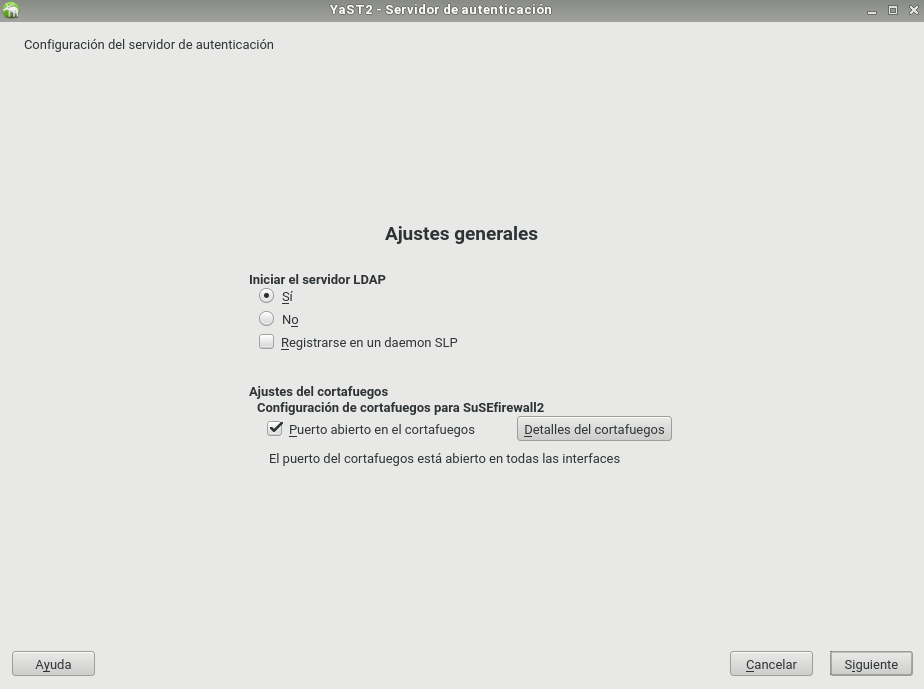
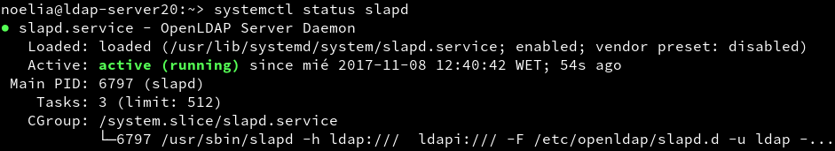

___

# **Servidor LDAP - OpenSUSE.**

---

# **1. Servidor LDAP.**

Hay varias herramientas que implementan el protocolo LDAP, por ejemplo, OpenLDAP, 389-DC, Active Directory, etc.

En esta práctica vamos a Instalar y Configurar el Servidor LDAP con OpenLDAP.

## **1.1. Preparar La Máquina.**

Vamos a usar una MV OpenSUSE para montar nuestro servidor LDAP con la siguiente configuración.

* Nombre equipo: ldap-server20.

* Además en /etc/hosts añadiremos lo siguiente.

~~~
172.18.20.31    ldap-server20.curso1718   ldap-server20
127.0.0.3       noelia20.curso1718        noelia20
~~~

## **1.2. Instalación Del Servidor LDAP.**

Procedemos a la Instalación del módulo Yast que sirve para gestionar el servidor LDAP, para ello vamos a linea de comandos y escribimos zypper install yast2-auth-server.

A continuación vamos a Yast, Servidor de autenticación.

Al entrar al Servidor de autenticación nos pedira instalar los paquetes: openldap2, krb5-server y krb5-client.

Dentro del Servidor de autenticación seguimos los siguientes pasos.

* Iniciar servidor LDAP -> Sí.

* Registrar dameon SLP -> No.

* Puerto abierto en el cortafuegos -> Sí.

* Tipo de servidor -> autónomo.

* Configuración TLS -> No habilitar.

* Tipo de BD -> hdb.

* DN base -> dc=noelia20,dc=curso1617.

* DN administrador -> dn=Administrator.

* Añadir DN base -> Sí.

* Contraseña del administrador.

* Directorio de BD -> /var/lib/ldap.

* Usar esta BD predeterminada para clientes LDAP -> Sí.

* Habilitar kerberos -> No.

Ahora haremos una serie de comprobaciones con los siguientes comandos.

* slaptest -f /etc/openldap/slapd.conf para comprobar la sintaxis del fichero do configuración.

* systemctl status slapd, para comprobar el estado del servicio.

* nmap localhost | grep -P '389|636', para comprobar que el servidor LDAP es accesible desde la red.

* slapcat para comprobar que la base de datos está bien configurada.

Podemos comprobar el contenido de la base de datos LDAP usando la herramienta gq. Esta herramienta es un browser LDAP.

Primero instalamos gq poniendo en linea de comandos zypper install gq.

Dentro de gq nos aparece lo siguiente.

Comprobamos que tenemos creadas las unidades organizativas: groups y people.

 <- falta

 <- falta

## **1.3. Crear Usuarios Y Grupos LDAP.**

Vamos a Yast, Usuarios Grupos, Filtro, LDAP.

 <- revisar

Creamos el grupos piratas20, esto se creará dentro de la ou=groups.

Creamos los usuarios pirata21, pirata21, estos se crearán dentro de la ou=people.

Usar gq para consultar/comprobar el contenido de la base de datos LDAP.

ldapsearch -x -L -u -t "(uid=nombre-del-usuario)", comando para consultar en la base de datos LDAP la información del usuario con uid concreto.

---

# **2. Autenticación.**

En este punto vamos a escribir información en el servidor LDAP.

## **2.1. Preparativos.**

Vamos a otra MV OpenSUSE. Cliente LDAP con OpenSUSE con la siguiente configuración.

* Nombre equipo: ldap-client20.

* Dominio: curso1718.

* Asegurarse que tenemos definido en el fichero `/etc/hosts del cliente`, el nombre DNS con su IP correspondiente.

~~~
127.0.0.2         ldap-client20.curso1718   ldap-client20
172.18.20.31      ldap-server20.curso1718   ldap-server20   noelia20.curso1718   noelia20
~~~

Comprobamos el resultado con los siguientes comandos.

* nmap -Pn ldap-server20 | grep -P '389|636', para comprobar que el servidor LDAP es accesible desde el cliente.

* Usar gq en el cliente para comprobar que se han creado bien los usuarios.

File, Preferencias, Servidor, Nuevo.

* URI = ldap://ldap-server20
* Base DN = dc=noelia20,dc=curso1718

## **2.2 Instalar Cliente LDAP.**

Vamos a configurar de la conexión del cliente con el servidor LDAP.

Debemos instalar el paquete yast2-auth-client, que nos ayudará a configurar la máquina para autenticación.

Ir a Yast, LDAP y cliente Kerberos.

Configurar como la imagen de ejmplo. Al final usamos la opción de Probar conexión

## **2.3 Comprobamos Desde El Cliente.**

Vamos a la consola y probamos con los siguientes comandos.

* getent passwd pirata21
* getent group piratas
* id pirata21.
* finger pirata21
* cat /etc/passwd | grep pirata21
* su pirata21

---

## **2.4. Autenticación.**

Con autenticacion LDAP prentendemos usar la máquina servidor LDAP, como repositorio centralizado de la información de grupos, usuarios, claves, etc. Desde otras máquinas conseguiremos autenticarnos (entrar al sistema) con los usuarios definidos no en la máquina local, sino en la máquina remota con LDAP. Una especie de Domain Controller.

Entrar en la MV cliente con algún usuario LDAP.

---
