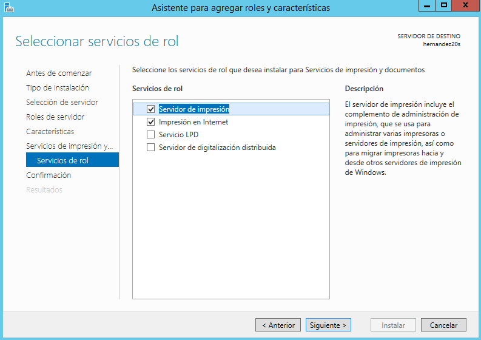

___

# **Servidor De Impresión En Windows.**

---

Necesitaremos 2 MV.

* 1 Windows Server.

  * Nombre de equipo:

* 1 Windows Cliente.

  * Nombre de equipo:

---

# **1. Impresora Compartida.**

## **1.1. Rol Impresión.**

Vamos al Servidor.

Instalamos rol/función de servidor de impresión. Incluimos impresión por internet.

## **1.2 Instalar Impresora PDF.**

Vamos a conectarnos e instalar localmente una impresora al Servidor Windows Server, de modo que estén disponibles para ser accedidas por los Clientes del dominio.

En nuestro caso, dado que es posible de que no tengan una impresora física en casa y no es de mucho interés forzar la instalación de una impresora que no se tiene, vamos a instalar un programa que simule una impresora de PDF.

~~~
PDF Creator: Para activar el modo AUTOSAVE vamos a Ajustes -> Autosave. Ahí configuramos carpeta destino.
~~~

Descargar PDFCreator (URL recomendada www.pdfforge.org/pdfcreator/download) e instalar.

Vamos a instalar PDFCreator. Vamos a la página oficial de [PDFCreator](http://pdfcreator.es/) para descargarlo.

En PDFCreator, configurar en perfiles -> Guardar -> Automático. Ahí configuramos carpeta destino.

En PDFCreator, activar el modo AUTOSAVE vamos a Ajustes -> Autosave. Ahí configuramos carpeta destino.

PDFCreator es una utilidad completamente gratuita con la que podrás crear archivos PDF desde cualquier aplicación, desde el Bloc de notas hasta Word, Excel, etc. Este programa funciona simulando ser una impresora, de esta forma, instalando PDFCreator todas tus aplicaciones con opción para imprimir te permitirán crear archivos PDF en cuestión de segundos.

La instalación de este programa no tiene dificultad simplemente elegir la opción "Instalación estándar".

// Para crear un archivo PDF no hará falta que cambies la aplicación que estés usando, simplemente ve a la opción de "imprimir" y selecciona "PDFCreator", en segundos tendrás creado tu archivo PDF. Rápido y fácil. La instalación de este programa no tiene dificultad simplemente elegir la opción "Instalación estándar".

Mientras se va instalando nos sale que PDFCreator requiere NET FrameWork v4.

## **1.3. Probar La Impresora En Local.**

Para crear un archivo PDF no hará falta que cambies la aplicación que estés usando, simplemente ve a la opción de "imprimir" y selecciona "Impresora PDF", en segundos tendrás creado tu archivo PDF.

Podemos probar la nueva impresora abriendo el Bloc de notas y creando un fichero, luego seleccionamos imprimir y como impresora predeterminada el PDFCreator. Cuando finalice el proceso se abrirá un fichero PDF en el PDFCreator con el resultado de la impresión.

## **1.4. Compartir Por Red.**

Vamos al servidor.

Botón derecho -> Propiedades -> Compartir
Como nombre del recurso compartido utilizar PDFnombrealumnoXX.

La siguiente imagen muestra los recursos compartidos en el servidor incluido la impresora.

Compartimos la impresora del servidor. Como nombre del recurso compartido he utilizado PDFnoelia20.

Vamos al cliente:

Buscar recursos de red del servidor. Si tarda en aparecer ponemos \\ip-del-servidor en la barra de navegación.
Seleccionar impresora -> botón derecho -> conectar.
    Ponemos usuario/clave del Windows Server.
Ya tenemos la impresora remota configurada en el cliente.
Probar la impresora remota.

---

# **2. Acceso Web.**

Realizaremos una configuración para habilitar el acceso web a las impresoras del dominio.

## **2.1. Instalar Característica Impresión WEB.**

Vamos al Servidor.

![imagen]

Nos aseguramos de tener instalado el servicio "Impresión de Internet".

![imagen]

## **2.2. Configurar Impresión WEB.**

Vamos al Cliente.

![imagen]

Abrimos un navegador Web.

Ponemos URL http://172.18.20.21/printers para que aparezca en nuestro navegador un entorno que permite gestionar las impresoras de dicho equipo, previa autenticación como uno de los usuarios del habilitados para dicho fin (por ejemplo el "Administrador").

![imagen]

Pincha en la opción propiedades y se muestra la siguiente pantalla.

![imagen]

Agregamos la impresora en el cliente utilizando la URL, como se muestra en la siguiente pantalla.

![imagen]

## **2.3. Comprobar Desde El Navegador.**

Vamos a realizar seguidamente una prueba sencilla en tu impresora de red.

A través del navegador pausa todos los trabajos en la impresora.

Envía a imprimir en tu impresora compartida un documento del Bloc de notas. La siguiente pantalla muestra que la impresora esta en pausa y con el trabajo en cola de impresión.

![imagen]

Finalmente pulsa en reanudar el trabajo para que tu documento se convierta a PDF. Comprobar que se puede imprimir desde un cliente Windows.

![imagen]

Si tenemos problemas para que aparezca el PDF en el servidor, iniciar el programa PDFCreator y esperar un poco.

---
