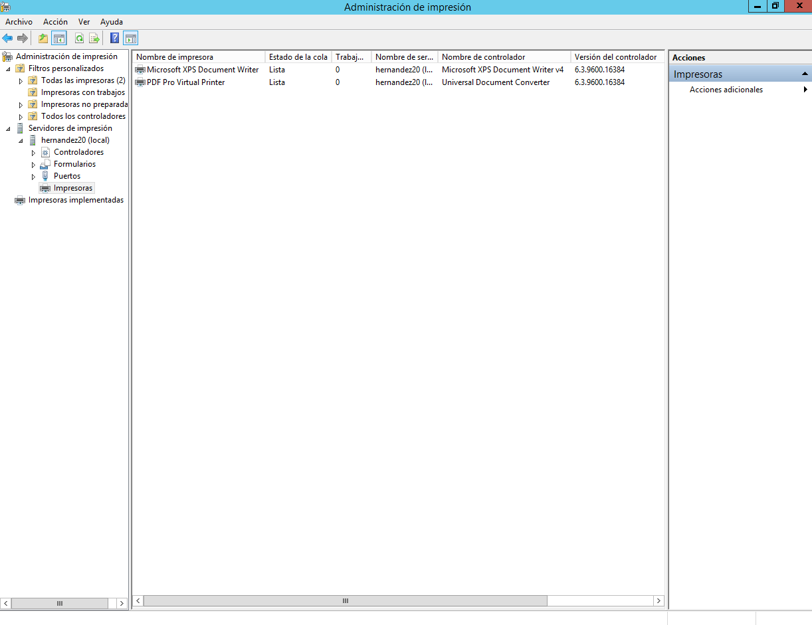
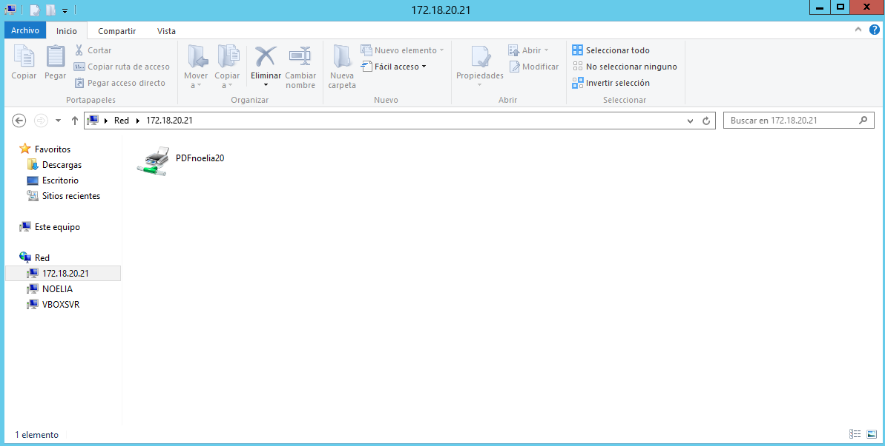
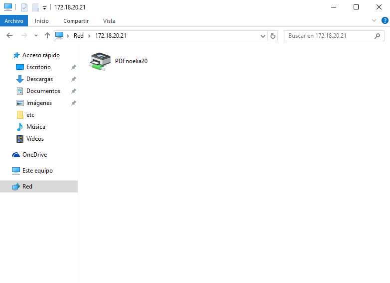
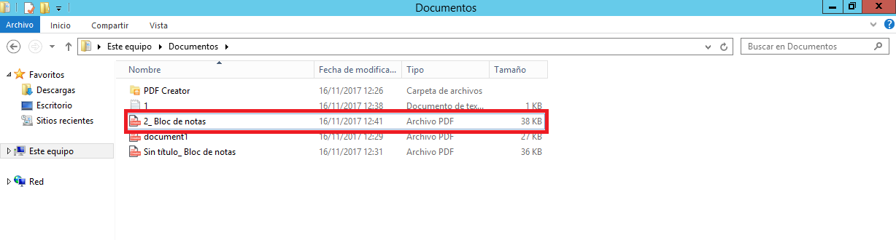
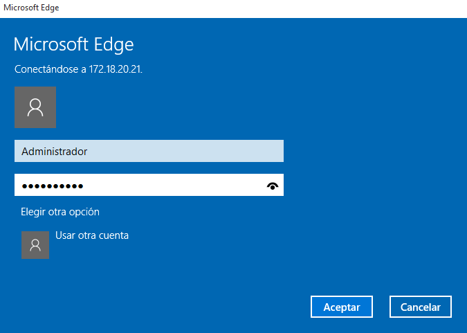
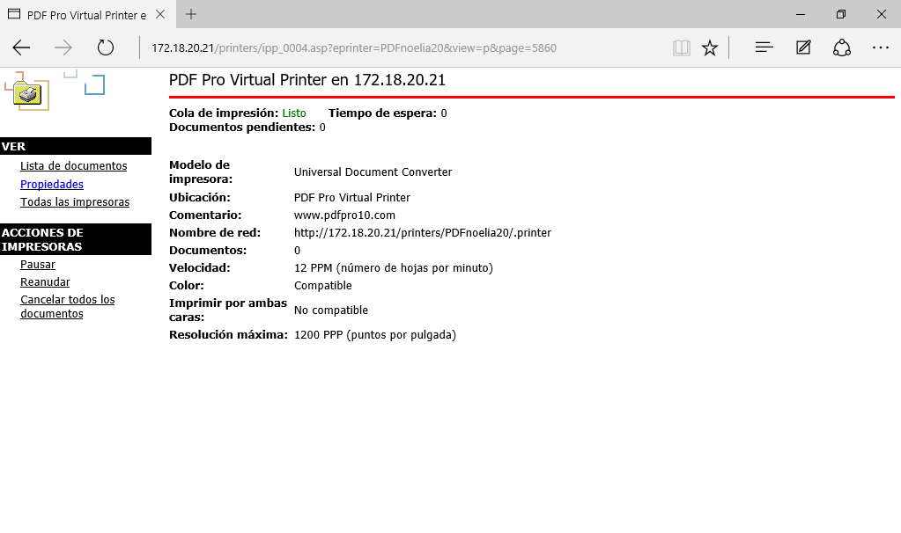
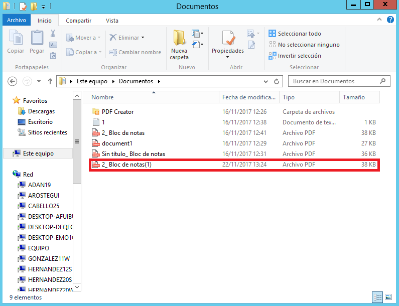

___

# **Servidor De Impresión En Windows.**

---

Necesitaremos 2 MVs.

* 1 Windows Server.

* 1 Windows Cliente.

---

# **1. Impresora Compartida.**

## **1.1. Rol Impresión.**

Vamos al Servidor. Concretamente al Panel de Administrador del Servidor.

Instalamos rol/función de Servidor de impresión. También incluimos Impresión en internet.

Tenemos que ir a Administrar y vamos a Agregar roles y características.

El resto de pasos los realizamos como se pueden ver en las imágenes.

Finalmente terminamos la instalación del Servidor de impresión e Impresión en internet en Windows 2012 Server.

## **1.2. Instalar Impresora PDF.**

Vamos a conectarnos e instalar localmente una impresora al Servidor Windows Server, de modo que esté disponible para ser accedida por los Clientes del dominio.

En nuestro caso, dado que es posible de que no tengamos una impresora física en casa y no es de mucho interés forzar la instalación de una impresora que no se tiene, vamos a instalar un programa que simule una impresora de PDF.

Vamos a instalar PDFCreator. Para ello vamos a la página oficial de [PDFCreator](https://pdfcreator.es/) para descargarlo y lo instalamos.

> PDFCreator es una utilidad completamente gratuita con la que se pueden crear archivos PDF desde cualquier aplicación, desde el Bloc de notas hasta Word, Excel, etc. Este programa funciona simulando ser una impresora, de esta forma, instalando PDFCreator todas nuestras aplicaciones con opción para imprimir nos permitirán crear archivos PDF en cuestión de segundos.

Mientras se va instalando nos sale que PDFCreator requiere NET FrameWork v4.

Finalmente terminamos la instalación del PDFCreator en Windows 2012 Server.

## **1.3. Probar La Impresora En Local.**

Para crear un archivo PDF no hará falta que cambiemos la aplicación que estemos usando, simplemente vamos a la opción de "imprimir" y seleccionamos "Impresora PDF", en segundos tendremos creado un archivo PDF.

Podemos probar la nueva impresora abriendo el Bloc de notas y creando un fichero luego seleccionamos imprimir. Cuando finalice el proceso se abrirá un fichero PDF con el resultado de la impresión.

## **1.4. Compartir Por Red.**

Vamos al Servidor. Concretamente a Administración de impresión.

Vamos al Botón derecho, Propiedades, Compartir.

Como nombre del recurso compartido utilizamos PDFnoelia20.

Ya tenemos la impresora en los recursos compartidos del Servidor.

Vamos al Cliente. Buscamos recursos de red del Servidor. Como nos tarda en aparecer ponemos \\\172.18.20.21 en la barra de navegación.

Seleccionamos la impresora, botón derecho, conectar.

Ya tenemos la impresora remota configurada en el Cliente.

Probamos la impresora remota. Podemos probar abriendo el Bloc de notas y creando un fichero luego seleccionamos imprimir. Cuando finalice el proceso se creará un fichero PDF en el directorio donde se encuentran todos los archivos de PDFCreator.

---

# **2. Acceso Web.**

Realizaremos una configuración para habilitar el acceso web a las impresoras del dominio.

## **2.1. Instalar Característica Impresión WEB.**

Vamos al Servidor.

El Servicio Impresión en internet ya lo tenemos instalado porque lo instalamos desde el principio.

## **2.2. Configurar Impresión WEB.**

Vamos al Cliente.

Abrimos un navegador Web. Ponemos la URL `http://172.18.20.21/printers` para que aparezca en nuestro navegador un entorno que permite gestionar las impresoras de dicho equipo, previa autenticación como uno de los usuarios del habilitados para dicho fin,por ejemplo, el "Administrador".

Pinchamos en la opción de propiedades.

Agregamos la impresora en el cliente utilizando la URL.

## **2.3. Comprobar Desde El Navegador.**

Vamos a realizar seguidamente una prueba sencilla en la impresora de red.

A través del navegador pausamos todos los trabajos en la impresora.

Enviamos a imprimir en la impresora compartida un documento del Bloc de notas.

Finalmente pulsamos en reanudar el trabajo para que el documento se convierta a PDF. Comprobamos que se puede imprimir desde un Cliente Windows.

---
