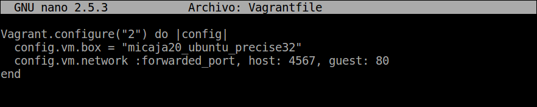
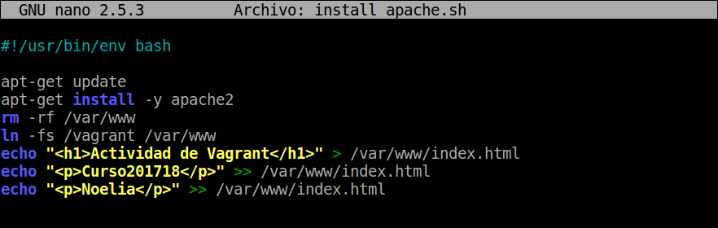
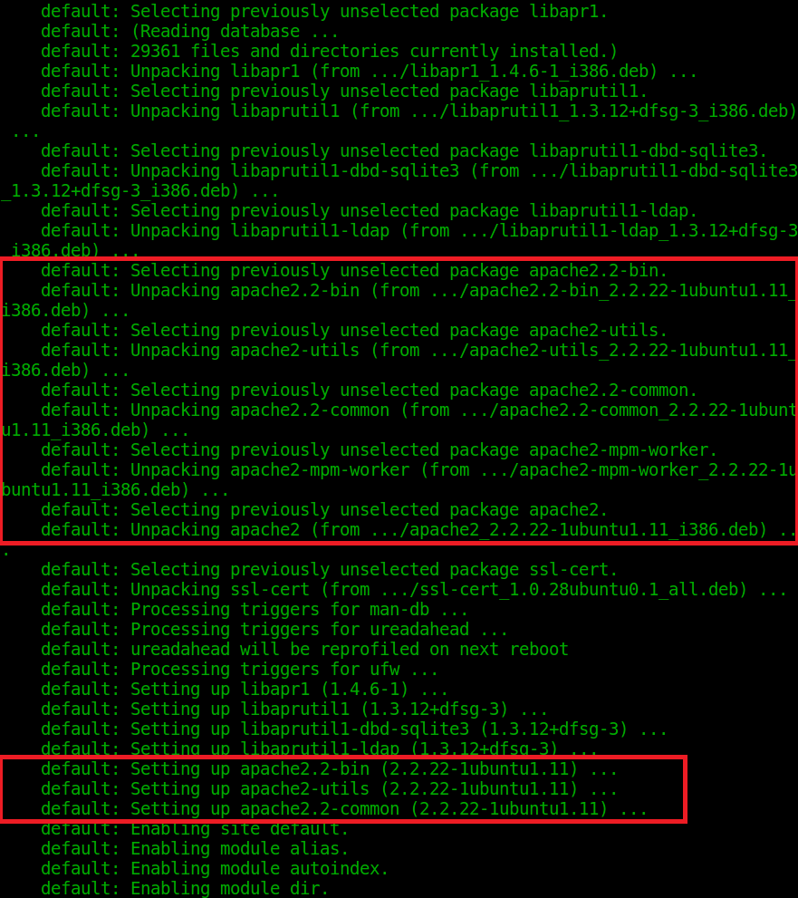

___

# **Vagrant Y VirtualBox.**

---

# **1. Introducción.**

Vagrant es una herramienta para la creación y configuración de entornos de desarrollo virtualizados.

Originalmente se desarrolló para VirtualBox y sistemas de configuración tales como Chef, Salt y Puppet. Sin embargo desde la versión 1.1. Vagrant es capaz de trabajar con múltiples proveedores, como VMware, Amazon EC2, LXC, DigitalOcean, etc.

Aunque Vagrant se ha desarrollado en Ruby se puede usar en multitud de proyectos escritos en otros lenguajes.

---

# **2. Primeros Pasos.**

## **2.1. Instalar.**

La instalación debemos hacerla en una máquina real. En nuestra máquina real ya tenemos instalado Vagrant.

Comprobamos la versión actual de Vagrant con el comando vagrant version.

Comprobamos la versión actual de VirtualBox con el comando VBoxManage -v.

Para trabajar con Vagrant con MV de VirtualBox se tiene que comprobar que las versiones de ambos son compatibles entre sí.

## **2.2. Proyecto.**

Creamos un directorio para nuestro proyecto vagrant.

~~~
* mkdir mivagrant20.
* cd mivagrant20.
* vagrant init.
~~~

[imagen03](./images/03.png)

## **2.3. Imagen, Caja O Box.**

Ahora necesitamos obtener una imagen (caja, box) de un sistema operativo. Vamos a conseguir una imagen de un Ubuntu Precise de 32 bits.

Utilizamos el comando vagrant box list para listar las cajas/imágenes disponibles actualmente en nuestra máquina y podemos comprobar que no hay ninguna.

Utilizamos el comando vagrant box add micaja20_ubuntu_precise32 http://files.vagrantup.com/precise32.box para crear una nueva caja.

Utilizamos denuevo el comando vagrant box list.

Para usar una caja determinada en nuestro proyecto, modificamos el fichero Vagrantfile (dentro de la carpeta de nuestro proyecto).

Cambiamos la línea config.vm.box = "base" por config.vm.box = "micaja20_ubuntu_precise32".

## **2.4. Iniciar Una Nueva Máquina.**

Vamos a iniciar una máquina virtual nueva usando Vagrant.

~~~
* cd mivagrant20.
* vagrant up, comando para iniciar una nueva instancia de la máquina.
~~~

>Comandos útiles de Vagrant.
>
>* vagrant ssh, conectar/entrar en nuestra máquina virtual usando SSH.
>* vagrant suspend, suspender la máquina virtual. Hay que tener en cuenta que la MV en modo suspendido consume más espacio en disco debido a que el estado de la máquina virtual que suele almacenarse en la RAM se pasa a disco.
>* vagrant resume, volver a despertar la máquina virtual.
>* vagrant halt, apagarla la máquina virtual.
>* vagrant status, estado actual de la máquina virtual.
>* vagrant destroy, para eliminar la máquina virtual (no los ficheros de configuración).

---

# **3. Configuración Del Entorno Virtual.**

## **3.1. Carpetas Sincronizadas.**

La carpeta del proyecto que contiene el Vagrantfile es visible para el sistema el virtualizado, esto nos permite compartir archivos fácilmente entre los dos entornos.

Para identificar las carpetas compartidas dentro del entorno virtual hacemos lo siguiente.

~~~
* vagrant up.
* vagrant ssh.
* ls /vagrant.
~~~

Esto nos mostrará que efectivamente el directorio /vagrant dentro del entorno virtual posee el mismo Vagrantfile que se encuentra en nuestro sistema anfitrión.

## **3.2 Redireccionamiento De Los Puertos.**

Cuando trabajamos con máquinas virtuales, es frecuente usarlas para proyectos enfocados a la web, y para acceder a las páginas es necesario configurar el enrutamiento de puertos.

Entramos en la MV e instalamos apache.

~~~
* vagrant ssh.
* apt-get install apache2.
~~~

Modificamos el fichero Vagrantfile, de modo que el puerto 4567 del sistema anfitrión sea enrutado al puerto 80 del ambiente virtualizado.

config.vm.network :forwarded_port, host: 4567, guest: 80

Luego iniciamos la MV, si ya se encuentra en ejecución lo podemos refrescar con vagrant reload.

Para confirmar que hay un servicio a la escucha en 4567, desde la máquina real podemos ejecutar los siguientes comandos.

* nmap -p 4500-4600 localhost, debe mostrar 4567/tcp open tram.

* netstat -ntap, debe mostrar tcp 0.0.0.0:4567 0.0.0.0:* ESCUCHAR.

En la máquina real, abrimos el navegador web con el URL http://127.0.0.1:4567. En realidad estamos accediendo al puerto 80 de nuestro sistema virtualizado.

También podemos abrir el navegador web con el URL http://172.18.20.0:4567 y nos saldra el mismo resultado.

---

## **4. Suministro.**

Una de los mejores aspectos de Vagrant es el uso de herramientas de suministro. Esto es, ejecutar "una receta" o una serie de scripts durante el proceso de arranque del entorno virtual para instalar, configurar y personalizar un sin fin de aspectos del SO del sistema anfitrión.

* vagrant halt, apagamos la MV.

* vagrant destroy, destruimos la MV para volver a empezar.

## **4.1. Suministro Mediante Shell Script.**

Ahora vamos a suministrar a la MV un pequeño script para instalar Apache.

Crear el script install_apache.sh, dentro del proyecto con el siguiente contenido.

~~~
#!/usr/bin/env bash

apt-get update
apt-get install -y apache2
rm -rf /var/www
ln -fs /vagrant /var/www
echo "<h1>Actividad de Vagrant</h1>" > /var/www/index.html
echo "
Curso201718
" >> /var/www/index.html
echo "
Noelia
" >> /var/www/index.html
~~~

Ponemos permisos de ejecución al script.

Vamos a indicar a Vagrant que debe ejecutar dentro del entorno virtual un archivo install_apache.sh.

Modificar Vagrantfile y agregar la siguiente línea a la configuración: config.vm.provision :shell, :path => "install_apache.sh"

Volvemos a crear la MV. Usamos el comando vagrant up.

Podremos notar, al iniciar la máquina, que en los mensajes de salida se muestran mensajes que indican cómo se va instalando el paquete de Apache que indicamos.

Para verificar que efectivamente el servidor Apache ha sido instalado e iniciado, abrimos navegador en la máquina real con URL http://127.0.0.1:4567.

## **4.2. Suministro Mediante Puppet.**

Se pide hacer lo siguiente. Modificar el archivo el archivo Vagrantfile de la siguiente forma.

~~~
Vagrant.configure(2) do |config|
  ...
  config.vm.provision "puppet" do |puppet|
    puppet.manifest_file = "default.pp"
  end
 end
~~~

Creamos un fichero manifests/default.pp, con las órdenes/instrucciones puppet para instalar el programa nmap.

~~~
package { 'nmap':
  ensure => 'present',
}
~~~

Para que se apliquen los cambios de configuración con la MV encendida recargamos la configuración y volvemos a ejecutar la provisión (vagrant reload, vagrant provision).

---

# **5. Nuestra Caja Personalizada.**

En los apartados anteriores hemos descargado una caja/box de un repositorio de Internet, y luego la hemos provisionado para personalizarla. En este apartado vamos a crear nuestra propia caja/box personalizada a partir de una MV de VirtualBox.

## **5.1 Preparar La MV VirtualBox.**

Lo primero que tenemos que hacer es preparar nuestra máquina virtual con una configuración por defecto, por si queremos publicar nuestro Box, ésto se realiza para seguir un estándar y que todo el mundo pueda usar dicho Box.

Crear una MV VirtualBox nueva o usar una que ya tengamos.

Instalar OpenSSH Server en la MV.

Crear el usuario Vagrant, para poder acceder a la máquina virtual por SSH. A este usuario le agregamos una clave pública para autorizar el acceso sin clave desde Vagrant.

* useradd -m vagrant
* su vagrant
* mkdir .ssh
* wget https://raw.githubusercontent.com/mitchellh/vagrant/master/keys/vagrant.pub -O .ssh/authorized_keys
* chmod 700 .ssh
* chmod 600 .ssh/authorized_keys

Poner clave vagrant al usuario vagrant y al usuario root.

Tenemos que conceder permisos al usuario vagrant para que pueda configurar la red, instalar software, montar carpetas compartidas, etc. para ello debemos configurar /etc/sudoers (visudo) para que no nos solicite la password de root, cuando realicemos estas operación con el usuario vagrant.

Añadir vagrant ALL=(ALL) NOPASSWD: ALL a /etc/sudoers.

Hay que comprobar que no existe una linea indicando requiretty si existe la comentamos.

>Debemos asegurarnos que tenemos instalado las VirtualBox Guest Additions con una versión compatible con el host anfitrion.~~~
root@hostname:~# modinfo vboxguest
filename:       /lib/modules/3.13.0-32-generic/updates/dkms/vboxguest.ko
version:        4.3.20
license:        GPL
description:    Oracle VM VirtualBox Guest Additions for Linux Module
author:         Oracle Corporation
srcversion:     22BF504734255C977E4D805
alias:          pci:v000080EEd0000CAFEsv00000000sd00000000bc*sc*i*
depends:        
vermagic:       3.13.0-32-generic SMP mod_unload modversions

>root@hostname:~# modinfo vboxguest |grep version
version:        4.3.20~~~

## **5.2. Crear La Caja Vagrant.**

Una vez hemos preparado la máquina virtual ya podemos crear el box.

Vamos a crear una nueva carpeta mivagrantXXconmicaja, para este nuevo proyecto vagrant.

Ejecutamos vagrant init para crear el fichero de configuración nuevo.

Localizar el nombre de nuestra máquina VirtualBox. VBoxManage list vms, comando de VirtualBox que lista las MV que tenemos.

Crear la caja package.box a partir de la MV.

Comprobamos que se ha creado la caja package.box en el directorio donde hemos ejecutado el comando.

Muestro la lista de cajas disponibles, pero sólo tengo 1 porque todavía no he incluido la que acabo de crear. Finalmente, añado la nueva caja creada por mí al repositorio de vagrant.

Al levantar la máquina con esta nueva caja obtengo este error. Probablemente por tener mal las GuestAdittions.

Pero haciendo vagrant ssh nos conectamos sin problemas con la máquina.

Recordar que podemos cambiar los parámetros de configuración de acceso SSH. Ver ejemplo:

config.ssh.username = 'root'
config.ssh.password = 'vagrant'
config.ssh.insert_key = 'true'

---
