___

# **Docker.**

---

# **1. Introducción.**

Es muy común que nos encontremos desarrollando una aplicación y llegue el momento que decidamos tomar todos sus archivos y migrarlos ya sea al ambiente de producción, de prueba o simplemente probar su comportamiento en diferentes plataformas y servicios. Para situaciones de este estilo existen herramientas que, entre otras cosas, nos facilitan el embalaje y despliegue de la aplicación, es aquí donde entra en juego Docker.

Esta herramienta nos permite crear lo que ellos denominan contenedores, lo cual son aplicaciones empaquetadas autosuficientes, muy livianas que son capaces de funcionar en prácticamente cualquier ambiente, ya que tiene su propio sistema de archivos, librerías, terminal, etc.

Docker es una tecnología contenedor de aplicaciones construida sobre LXC.

---

# **2. Requisitos.**

Vamos a usar en esta práctica una MV OpenSUSE. Nos aseguramos que tiene una versión del Kernel 3.10. o superior, para ello utilizamos el comando uname -a.

---

# **3. Instalación Y Primeras Pruebas.**

Ejecutamos como superusuario los siguientes comandos.

~~~
zypper in docker, instala docker.
systemctl start docker, inicia el Servicio.
docker version, muestra información del Cliente y del Servidor.
usermod -a -G docker noelia, añade permisos a nuestro usuario noelia.
~~~

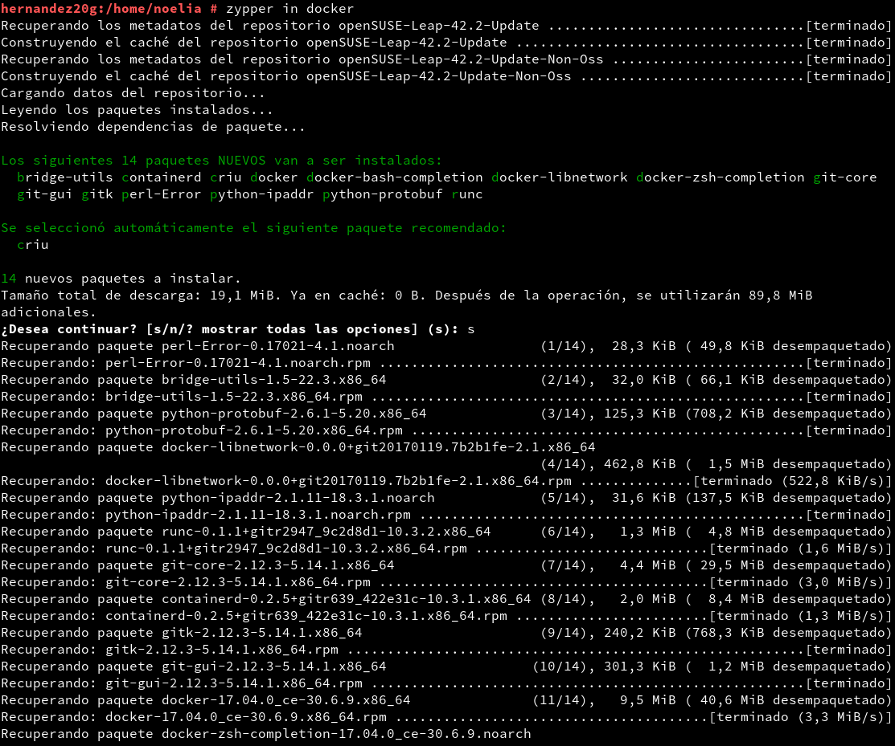

Salimos de la sesión y volvemos a entrar con nuestro usuario noelia.

Ejecutamos con nuestro usuario los siguientes comandos para comprobar que todo funciona.

~~~
docker images, muestra las imágenes descargadas hasta ahora.
docker ps -a, muestra todos los contenedores creados.
docker run hello-world, descarga y ejecuta un contenedor con la imagen hello-world.
docker images.
docker ps -a.
~~~

---

# **4. Configuración De La Red.**

Habilitamos el acceso a la red externa a los contenedores. Para openSUSE13.2., cuando el método de configuracion de red es Wicked, vamos a Yast, Dispositivos de red, Encaminamiento y pinchamos en Habilitar reenvío IPv4.

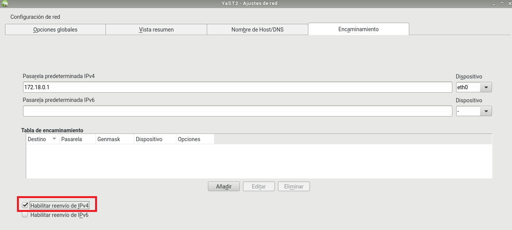

Reiniciamos el equipo para que se apliquen los cambios.

---

# **5. Crear Un Contenedor Manualmente.**

Nuestro SO base es OpenSUSE, vamos a crear un contenedor Debian8, y dentro instalaremos Nginx.

## **5.1. Crear Una Imagen.**

Utilizamos los siguientes comandos.

~~~
docker images, vemos las imágenes disponibles localmente.
docker search debian, buscamos en los repositorios de Docker Hub contenedores con la etiqueta 'debian'.
docker pull debian:8, descargamos contenedor 'debian:8' en local.
docker images.
docker ps -a, vemos todos los contenedores.
docker ps, vemos sólo los contenedores en ejecución.
~~~

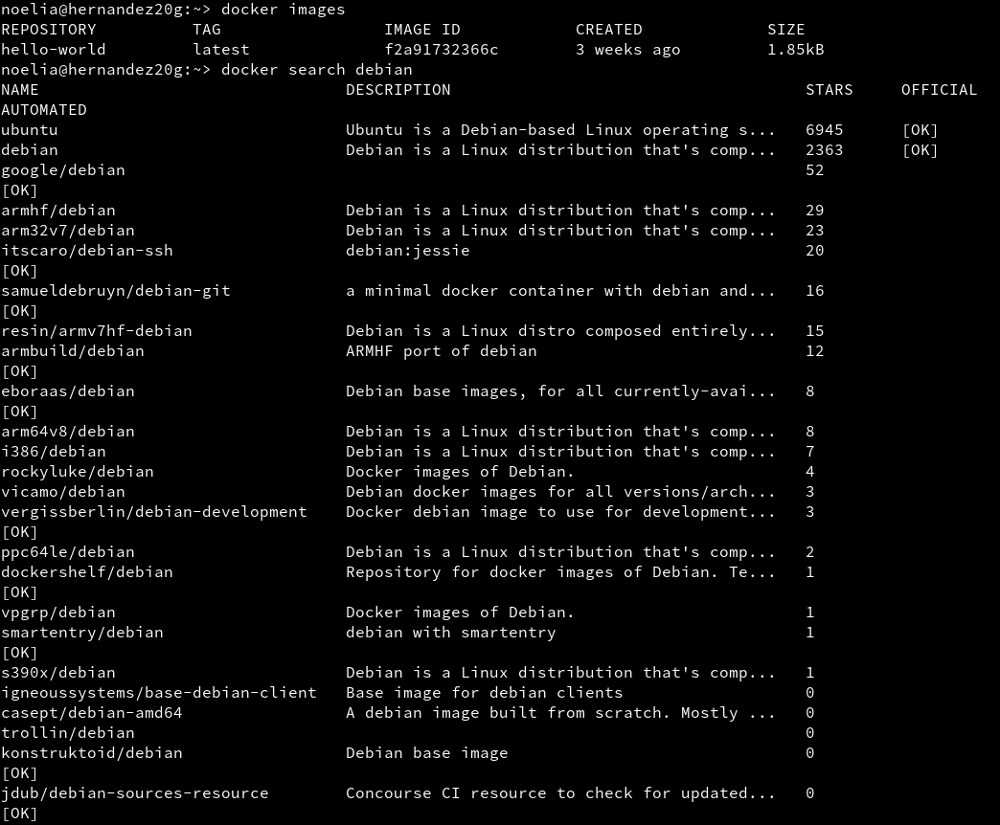

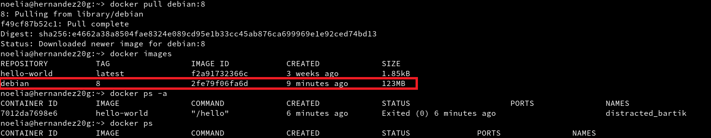

Vamos a crear un contenedor con el nombre `mv_debian` a partir de la imagen debian:8, para ello ejecutaremos el comando docker run --name=mv_debian -i -t debian:8 /bin/bash.

Dentro del contenedor hacemos lo siguiente.

~~~
cat /etc/motd, comprobamos que estamos en Debian.
apt-get update.
apt-get install -y nginx, instalamos nginx en el contenedor.
apt-get install -y nano, instalamos editor nano en el contenedor.
/usr/sbin/nginx, iniciamos el servicio nginx.
ps -ef.
~~~

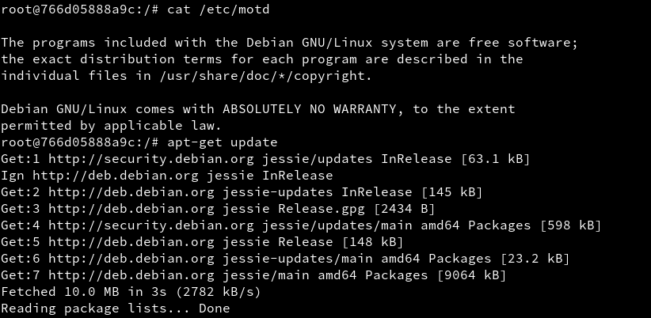

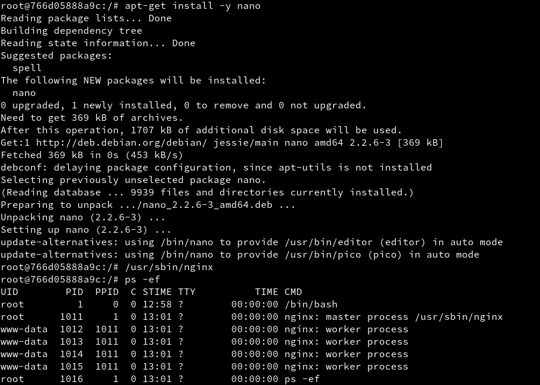

Creamos un fichero HTML holamundo.html. Para ello utilizamos el comando `echo "
Hola nombre-del-alumno
" > /var/www/html/holamundo.html`.

Creamos tambien un script `/root/server.sh` con el contenido que vemos a continuación.

~~~
#!/bin/bash

echo "Booting Nginx!"
/usr/sbin/nginx &

echo "Waiting..."
while(true) do
  sleep 60
done
~~~

Hay que poner permisos de ejecución al script para que se pueda ejecutar.

Este script inicia el programa/servicio y entra en un bucle, para permanecer activo y que no se cierre el contenedor.

Ya tenemos nuestro contenedor auto-suficiente de Nginx, ahora debemos crear una nueva imagen con los cambios que hemos hecho, para esto abrimos otra ventana de terminal y busquemos el ID del contenedor. Para ello utilizamos el comando docker ps.

Ahora con esto podemos crear la nueva imagen a partir de los cambios que realizamos sobre la imagen base, para hacer esto utilizamos los siguientes comandos.

~~~
docker commit 28efcd9eb4f8 noelia/nginx.
docker images.
~~~

Utilizamos los siguientes comandos para eliminar el contenedor.

~~~
docker ps.
docker stop mv_debian, paramos el contenedor.
docker ps.
docker ps -a, vemos el contenedor parado.
docker rm 28efcd9eb4f8, eliminamos el contenedor.
docker ps -a.
~~~

## **5.2. Crear Contenedor.**

Tenemos una imagen con Nginx instalado, probraremos ahora Docker.

Iniciemos el contenedor de la siguiente manera.

~~~
docker ps
docker ps -a
docker run --name=mv_nginx -p 80 -t noelia/nginx /root/server.sh
~~~

Los mensajes muestran que el script server.sh está en ejecución. No pararemos el programa.

Abrimos una nueva terminal. Utilizamos el comando docker ps, para que nos muestre los contenedores en ejecución.

Abrir navegador web y ponemos URL `locahost:32779`. De esta forma nos conectaremos con el servidor Nginx que se está ejecutando dentro del contenedor.

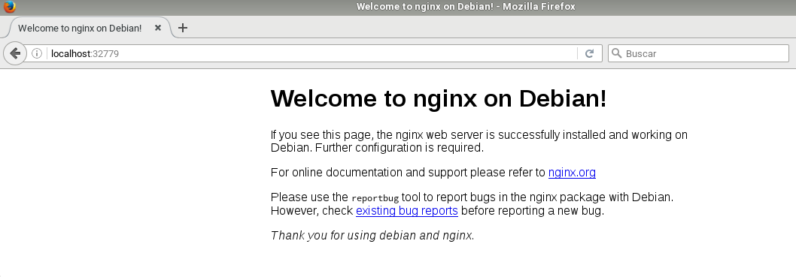

Paramos el contenedor y lo eliminamos.

~~~
docker ps.
docker stop mv_nginx.
docker ps.
docker ps -a.
docker rm mv_nginx.
docker ps -a.
~~~

Como ya tenemos una imagen docker, podemos crear nuevos contenedores cuando lo necesitemos.

---

# **6. Crear Un Contenedor Con Dockerfile.**

Ahora vamos a conseguir el mismo resultado del apartado anterior, pero usando un fichero de configuración, llamado Dockerfile.

## **6.1. Comprobaciones Iniciales.**

~~~
docker images
docker ps
docker ps -a
~~~

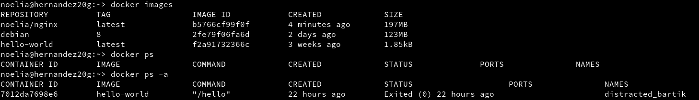

## **6.2. Preparar Ficheros.**

Creamos el directorio `/home/noelia/docker20`.

Creamos el fichero Dockerfile dentro de `/home/noelia/docker20` con el siguiente contenido.

~~~
FROM debian:8

MAINTAINER noelia 1.0

RUN apt-get update
RUN apt-get install -y apt-utils
RUN apt-get install -y nginx
RUN apt-get install -y vim

COPY holamundo.html /var/www/html
RUN chmod 666 /var/www/html/holamundo.html

COPY server.sh /root
RUN chmod +x /root/server.sh

EXPOSE 80

CMD ["/root/server.sh"]
~~~

Los ficheros server.sh y holamundo.html que vimos en el apartado anterior, tienen que estar en el mismo directorio del fichero Dockerfile.

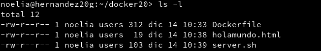

## **6.3. Crear Imagen.**

El fichero Dockerfile contiene la información necesaria para contruir el contenedor. Lo veremos utilizando los siguientes comandos.

~~~
cd /home/noelia/docker, entramos al directorio del Dockerfile.
docker images, consultamos las imágenes disponibles.
docker build -t noelia/nginx2 ., construye imagen a partir del Dockefile.
docker images, debe aparecer nuestra nueva imagen.
~~~

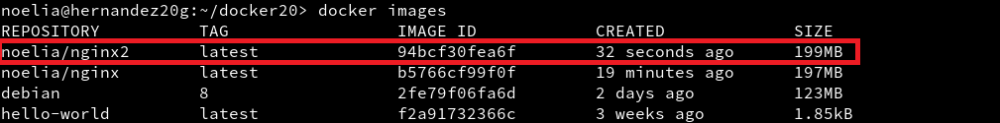

## **6.4. Crear Contenedor Y Comprobar.**

A continuación vamos a crear un contenedor con el nombre mv_nginx2, a partir de la imagen noelia/nginx, y queremos que este contenedor ejecute el programa `/root/server.sh`. Para esto utilizamos el comando docker run --name mv_nginx2 -p 80 -t noelia/nginx2 /root/server.sh.

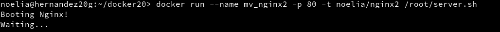

Desde otra terminal hacemos docker ps, para averiguar el puerto de escucha del servidor Nginx.

Comprobamos en el navegador URL `http://localhost:32780`.

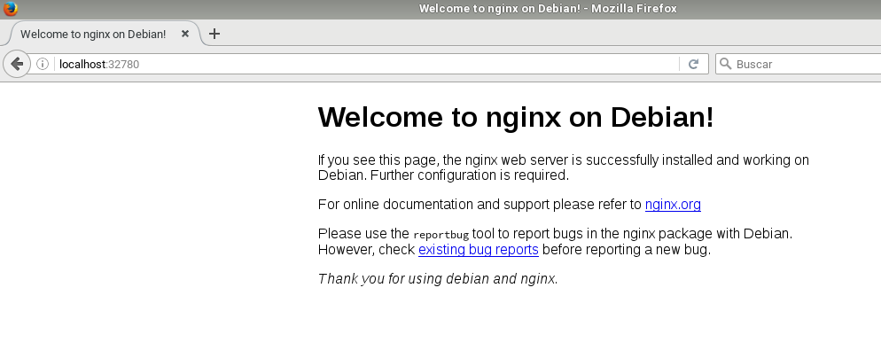

Comprobamos en el navegador URL `http://localhost:32780/holamundo.html`.

---

# **7. Migrar Las Imágenes De Docker A Otro Servidor.**

Creamos un imagen de contenedor.

~~~
docker ps, muestra los contenedores que tengo en ejecución.
docker commit -p 60c174041505 container-backup, graba una imagen de nombre "container-backup" a partir del contenedor 60c174041505.
docker images, comprobar que se ha creado la imagen "container-backup".
~~~

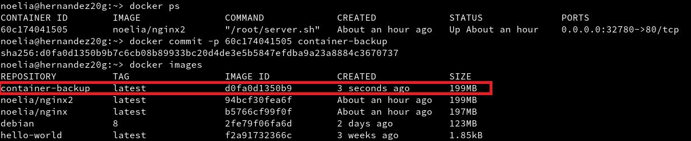

Exportamos la imagen docker a fichero. Para ello utilizamos el comando docker save -o ~/container-backup.tar container-backup, el cual guarda la imagen "container-backup" en un fichero tar.

Importamos la imagen docker desde fichero. Intercambiamos nuestros contenedores con un compañero. Nos traemos el tar a nuestra máquina con docker instalado, y restauramos.

~~~
docker load -i ~/kevin-container-backup.tar, cargamos la imagen docker a partir del fichero tar.
docker images, comprobamos que la nueva imagen está disponible.
~~~

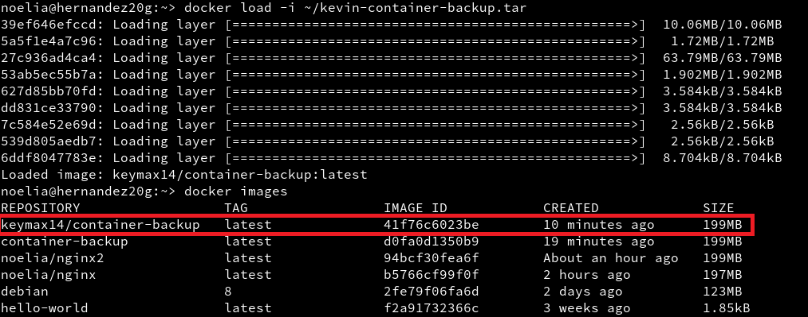

A continuación vamos a crear un contenedor con el nombre dock_kevin, a partir de la imagen keymax14/container-backup, y queremos que este contenedor ejecute el programa `/root/server.sh`. Para esto utilizamos el comando docker run --name dock_kevin -p 80 -t keymax14/container-backup /root/server.sh.

docker ps, muestra los contenedores que tenemos en ejecución.

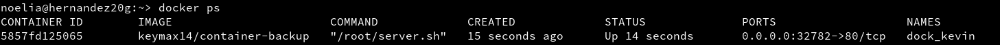

Comprobamos en el navegador URL `http://localhost:32782/holamundo.html`.

---
