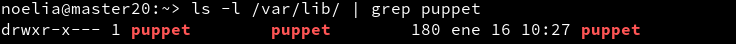

___
___

# **Puppet - OpenSUSE.**

---

# **1. Introducción.**

Existen varias herramientas para realizar instalaciones desde un punto central, como Chef, Ansible, CFEngine, etc. En este ejemplo, vamos a usar Puppet.

Según Wikipedia, Puppet es una herramienta diseñada para administrar la configuración de sistemas Unix-like y de Microsoft Windows de forma declarativa. El usuario describe los recursos del sistema y sus estados, ya sea utilizando el lenguaje declarativo de Puppet o un DSL (lenguaje específico del dominio) de Ruby.

## **1.1. Configuración.**

En OpenSUSE podemos configurar el equipo a través de Yast.

Vamos a usar 3 MV's con las siguientes configuraciones:

MV1 - master: Dará las órdenes de instalación/configuración a los clientes.
Configuración OpenSUSE.
IP estática 172.18.20.100
Nombre del equipo: master20
Dominio: curso1718

MV2 - cliente 1: recibe órdenes del master.
Configuración OpenSUSE.
IP estática 172.18.20.101
Nombre del equipo: cli1alu20
Dominio: curso1718

MV3 - client2: recibe órdenes del master.
Configuración SO Windows 10.
IP estática 172.18.20.102
Nombre Netbios: cli2alu20
Nombre del equipo: cli2alu20

Configurar /etc/hosts.

Cada MV debe tener configurada en su /etc/hosts al resto de hosts, para poder hacer ping entre ellas usando los nombres. Con este fichero obtenemos resolución de nombres para nuestras propias MV's sin tener un servidor DNS.

~~~
GNU/Linux

El fichero /etc/hosts debe tener un contenido similar a:

127.0.0.1       localhost
127.0.0.2       master20.curso1718    master20
172.18.20.100   master20.curso1718   master20
172.18.20.101   cli1alu20.curso1718   cli1alu20
172.18.20.102   cli2alu20

Windows

Para localizar el fichero hosts de Windows, vamos a la ruta de la imagen:

El contenido del fichero hosts de Windows tiene el siguiente aspecto:
~~~

## **1.2. Comprobar Las Configuraciones.**

En GNU/Linux, para comprobar que las configuraciones son correctas hacemos:

~~~
date
ip a
route -n
host www.google.es
hostname -a
hostname -f               # Comprobar que devuelve el valor correcto!!!
hostname -d
tail -n 5 /etc/hosts
ping master20
ping master20.curso1718
ping cli1alu20
ping cli1alu20.curso1718
ping cli2alu20
ping cli2alu20.curso1718   
~~~

En Windows comprobamos con:

~~~
date
ipconfig
route /PRINT
nslookup www.google.es
ping master20
ping master20.curso1718
ping cli1alu20
ping cli1alu20.curso1718
ping cli2alu20
ping cli2alu20.curso1718  
~~~

# **2. Primera Versión Del Fichero pp.**

Instalamos Puppet Master en la MV master20:

zypper install rubygem-puppet-master (Leap).

El paquete puppet-vim, sólo es para que el editor vim detecte la sintaxis de puppet.

systemctl status puppetmaster: Consultar el estado del servicio.
systemctl enable puppetmaster: Permitir que el servicio se inicie automáticamente en el inicio de la máquina.
systemctl start puppetmaster: Iniciar el servicio.
systemctl status puppetmaster: Consultar el estado del servicio.

En este momento debería haberse creado el directorio `/etc/puppet/manifests`.

Preparamos los ficheros/directorios en el master.

mkdir `/etc/puppet/files`
touch `/etc/puppet/files/readme.txt`
mkdir `/etc/puppet/manifests`
touch `/etc/puppet/manifests/site.pp`
mkdir `/etc/puppet/manifests/classes`
touch `/etc/puppet/manifests/classes/hostlinux1.pp`

## **2.1. readme.txt.**

Los ficheros que se guardan en `/etc/puppet/files` se pueden descargar desde el resto de máquinas cliente puppet.

Contenido para readme.txt: "¡Al abordaje!".

## **2.2. site.pp.**

`/etc/puppet/manifests/site.pp` es el fichero principal de configuración de órdenes para los agentes/nodos puppet.

Contenido de nuestro site.pp.

~~~
import "classes/*"

node default {
  include hostlinux1
}
~~~

## **2.3. hostlinux1.pp.**

Como podemos tener muchas configuraciones, vamos a separarlas en distintos ficheros para organizarnos mejor, y las vamos a guardar en la ruta /etc/puppet/manifests/classes

Vamos a crear una primera configuración para máquina estándar GNU/Linux.

Contenido para `/etc/puppet/manifests/classes/hostlinux1.pp`.

~~~
class hostlinux1 {
  package { "tree": ensure => installed }
  package { "traceroute": ensure => installed }
  package { "geany": ensure => installed }
}
~~~

tree `/etc/puppet`, consultar los ficheros/directorios que tenemos creado.

Comprobar que tenemos los permisos adecuados en la ruta `/var/lib/puppet`. Esto es, usuario puppet y grupo puppet.

Reiniciamos el servicio systemctl restart puppetmaster.

Comprobamos que el servicio está en ejecución de forma correcta.

systemctl status puppetmaster
netstat -ntap |grep ruby

Consultamos log por si hay errores: tail `/var/log/puppet/*.log`

Abrir el cortafuegos para el servicio.

# **3. Instalación Y Configuración Del Cliente1.**

Vamos a instalar y configurar el cliente 1.

Vamos a la MV cliente 1.

Instalar el Agente Puppet.

zypper install rubygem-puppet

El cliente puppet debe ser informado de quien será su master. Para ello, vamos a configurar `/etc/puppet/puppet.conf`.

~~~
[main]
# Definir el host master puppet
server=master20.curso1718
...
[agent]
...
# Desactivar los plugin para este agente
pluginsync=false
~~~

Veamos imagen de ejemplo de Raúl García Heredia:

Comprobar que tenemos los permisos adecuados en la ruta `/var/lib/puppet`.

systemctl status puppet: Ver el estado del servicio puppet.
systemctl enable puppet: Activar el servicio en cada reinicio de la máquina.
systemctl start puppet: Iniciar el servicio puppet.
systemctl status puppet: Ver el estado del servicio puppet.
netstat -ntap |grep ruby: Muestra los servicios conectados a cada puerto.

# **4. Certificados.** (hacer instantanea)

Antes de que el master acepte a cliente1 como cliente, se deben intercambiar los certificados entre ambas máquinas. Esto sólo hay que hacerlo una vez.

A partir de este momento ya no deberíamos cambiar los nombres de las máquinas.

## **4.1. Aceptar Certificado.**

Vamos a la MV master.

puppet cert list, consultamos las peticiones pendientes de unión al master:

root@master42# puppet cert list
"cli1alu30.curso1617" (D8:EC:E4:A2:10:55:00:32:30:F2:88:9D:94:E5:41:D6)
root@master42#

puppet cert sign "nombre-máquina-cliente", aceptar al nuevo cliente desde el master:

root@master42# puppet cert sign "cli1alu42.curso1617"
notice: Signed certificate request for cli1alu42.curso1617
notice: Removing file Puppet::SSL::CertificateRequest cli1alu42.curso1617 at '/var/lib/puppet/ssl/ca/requests/cli1alu42.curso1617.pem'

root@master42# puppet cert list

root@master42# puppet cert print cli1alu20.curso1718
Certificate:
Data:
....

A continuación podemos ver una imagen de ejemplo, los datos no tienen que coincidir con lo que se pide en el ejercicio.

## **4.2. Comprobación.**

Vamos a comprobar que las órdenes (manifiesto) del master, llega bien al cliente y éste las ejecuta.

Vamos a cliente1 y reiniciamos la máquina y/o el servicio Puppet.

Comprobar que los cambios configurados en Puppet se han realizado.

En caso contrario, ejecutar comando para comprobar errores:
puppet agent --test
puppet agent --server master42.curso1617 --test

Para ver el detalle de los errores, podemos reiniciar el servicio puppet en el cliente, y consultar el archivo de log del cliente: tail /var/log/puppet/puppet.log.

Puede ser que tengamos algún mensaje de error de configuración del fichero /etc/puppet/manifests/site.pp del master. En tal caso, ir a los ficheros del master y corregir los errores de sintáxis.

# **5. Segunda Versión Del Fichero pp.**

Ya hemos probado una configuración sencilla en PuppetMaster. Ahora vamos a pasar a configurar algo más complejo.

Contenido para /etc/puppet/manifests/classes/hostlinux2.pp:

~~~
class hostlinux2 {
  package { "tree": ensure => installed }
  package { "traceroute": ensure => installed }
  package { "geany": ensure => installed }

  group { "piratas": ensure => "present", }
  group { "admin": ensure => "present", }

  user { 'barbaroja':
    home => '/home/barbaroja',
    shell => '/bin/bash',
    password => 'saqueo',
    groups => ['piratas','admin','root']
  }

  file { "/home/barbaroja":
    ensure => "directory",
    owner => "barbaroja",
    group => "piratas",
    mode => 750
  }

  file { "/home/barbaroja/share":
    ensure => "directory",
    owner => "barbaroja",
    group => "piratas",
    mode => 750
  }

  file { "/home/barbaroja/share/private":
    ensure => "directory",
    owner => "barbaroja",
    group => "piratas",
    mode => 700
  }

  file { "/home/barbaroja/share/public":
    ensure => "directory",
    owner => "barbaroja",
    group => "piratas",
    mode => 755
  }
}
~~~

Para revisar

~~~
    package { "gnomine": ensure => 'absent' }

    file {  '/opt/readme.txt' :
     source => 'puppet:///files/readme.txt',
    }
~~~

Modificar /etc/puppet/manifests/site.pp para que se use la configuración de hostlinux2 el lugar de la anterior:

~~~
import "classes/*"

node default {
  include hostlinux2
}
~~~

Por defecto todos los nodos (máquinas clientes) van a coger la misma configuración.

tree /etc/puppet

# **6. Cliente Puppet Windows.**

Vamos a configurar Puppet para atender también a clientes Windows.

## **6.1. Modificaciones En El Master.**

Vamos a la MV master.

Vamos a crear una configuración puppet para las máquinas windows, dentro del fichero.

Crear /etc/puppet/manifests/classes/hostwindows3.pp, con el siguiente contenido:

~~~
class hostwindows3 {
  file {'C:\warning.txt':
    ensure => 'present',
    content => "Hola Mundo Puppet!",
  }
}
~~~

De momento, esta configuración es muy básica. Al final la ampliaremos algo más.

Ahora vamos a modificar el fichero site.pp del master, para que tenga en cuenta la configuración de clientes GNU/Linux y clientes Windows, de modo diferenciado:

~~~
import "classes/*"

node 'cli1alu42.curso1617' {
  include hostlinux2
}

node 'cli2alu42' {
  include hostwindows3
}
~~~

NOMBRES DE MÁQUINA

El master GNU/Linux del ejemplo se llama master42.curso1617

El cliente1 GNU/Linux del ejemplo se llama cli1alu42.curso1617

El cliente2 Windows del ejemplo se llama cli2alu42

tree /etc/puppet, para confirmar que tenemos los nuevos archivos.

Reiniciamos el servicio PuppetMaster.

Debemos instalar la misma versión de puppet en master y en los clientes.

Ejecutamos el comando facter, para ver la versión de Puppet que está usando el master.

El fichero puppet.conf en Windows está en C:\ProgramData\PuppetLabs\puppet\etc\puppet.conf. (ProgramData es una ruta oculta). Revisar que tenga algo como:

~~~
[main]
server=masterXX.curso1617 # Definir el host master
pluginsync=false          # Desactivar los plugin
~~~

## **6.2. Modificaciones En El Cliente2.**

Ahora vamos a instalar AgentePuppet en Windows. Recordar que debemos instalar la misma versión en ambos equipos (Usar comando facter para ver la versión de puppet).

    Descargamos e instalamos la versión de Agente Puppet para Windows similar al Puppet Master.
    Reiniciamos la MV.
    Debemos aceptar el certificado en el master para este nuevo cliente. Consultar apartado anterior y repetir los pasos para este nuevo cliente.

    Si no aparece el cliente Windows en em master

    Si en el master no nos aparece el certificado del cliente windows para ser aceptado, probar lo siguiente:

        Ir a cli2aluXX
        Ejecutar el "Agente Puppet"
        Abrir "Consola Puppet" -> Ejecutar puppet agent --server masterXX.curso1617 --test.
        Ir a masterXX -> puppet cert list
        Capturar pantallas de estos pasos.

    ¿Cómo desintalar Puppet en Windows?

    Consejos/sugerencias de Héctor Pedraza pars desinstalar Puppet en Windows:

    Si tenemos problemas con el certificado de la máquina windows cliente tenemos que seguir los siguientes pasos para eliminar cualquier rastro de los mismos y poder reintentar la comunicación:

        Borrar en el maestro el certificado correspondiente a esa máquina puppet cert clean nombre-netbios-cliente.
        Desinstalar el agente puppet en windows.
        Borrar las carpetas de datos del puppet, ya que no se borran en la desinstalación. Las carpetas son:
            C:\ProgramData\PuppetLabs y
            C:\Users\usuario\.puppet.
        Después reinstalamos y volvemos a probar.

    Si seguimos teniendo problemas para unir/conectar el cliente windows con el puppetmaster, porque no se realice el intercambio de certificados podemos:

        Repetir las recomendaciones anteriores para limpiar los datos, poner un nombre nuevo y diferente a la máquina Windows e intentarlo de nuevo.
        o usar una máquina Windows nueva (limpia de las acciones anteriores).

    Vamos al cliente2.

Con los comandos siguientes podremos hacernos una idea de como terminar de configurar el fichero puppet del master para la máquina Windows.

    Iniciar consola puppet como administrador y probar los comandos:
        puppet agent --configprint server, debe mostrar el nombre del servidor puppet. En nuestro ejemplo debe ser masterXX.curso1627.
        puppet agent --server masterXX.curso1617 --test: Comprobar el estado del agente puppet.
        puppet agent -t --debug --verbose: Comprobar el estado del agente puppet.
        facter: Para consultar datos de la máquina windows, como por ejemplo la versión de puppet del cliente.
        puppet resource user nombre-alumno1: Para ver la configuración puppet del usuario.
        puppet resource file c:\Users: Para var la configuración puppet de la carpeta.

Veamos imagen de ejemplo:

puppet-resource-windows

    Configuramos en el master el fichero /etc/puppet/manifests/classes/hostwindows4.pp para el cliente Windows:

class hostwindows4 {
  user { 'soldado1':
    ensure => 'present',
    groups => ['Administradores'],
  }

  user { 'aldeano1':
    ensure => 'present',
    groups => ['Usuarios'],
  }
}

    Crear un nuevo fichero de configuración para la máquina cliente Windows con el nombre /etc/puppet/manifests/classes/hostalumno5.pp.
    Incluir configuraciones elegidas por el alumno y probarlas.

---
