___

# **Puppet - OpenSUSE.**

---

# **1. Introducción.**

Existen varias herramientas para realizar instalaciones desde un punto central, como Chef, Ansible, CFEngine, etc. En este ejemplo, vamos a usar Puppet.

Según Wikipedia, Puppet es una herramienta diseñada para administrar la configuración de sistemas Unix-like y de Microsoft Windows de forma declarativa. El usuario describe los recursos del sistema y sus estados, ya sea utilizando el lenguaje declarativo de Puppet o un DSL (lenguaje específico del dominio) de Ruby.

## **1.1. Configuración.**

Vamos a usar 3 MV's con las siguientes configuraciones.

* MV1 - master: Dará las órdenes de instalación/configuración a los Clientes.
  * IP estática: 172.18.20.100.
  * Nombre del equipo: master20.
  * Dominio: curso1718.

* MV2 - Cliente 1: recibe órdenes del master.
  * IP estática: 172.18.20.101.
  * Nombre del equipo: cli1alu20.
  * Dominio: curso1718.

* MV3 - Cliente 2: recibe órdenes del master.
  * IP estática: 172.18.20.102.
  * Nombre Netbios: cli2alu20.
  * Nombre del equipo: cli2alu20.

Cada MV debe tener configurada en su `/etc/hosts` al resto de hosts, para poder hacer ping entre ellas usando los nombres largos y cortos. Con este fichero obtenemos resolución de nombres para nuestras propias MV's sin tener un servidor DNS.

* MV1.

  El fichero `/etc/hosts` debe tener el siguiente contenido.

  

  

* MV2.

  El fichero `/etc/hosts` debe tener el siguiente contenido.

  

  

* MV3.

  Para localizar el fichero hosts de Windows, vamos a la siguiente ruta.

  

  El contenido del fichero hosts de Windows tiene el siguiente aspecto.

  

## **1.2. Comprobar Las Configuraciones.**

En GNU/Linux, para comprobar que las configuraciones son correctas hacemos los siguientes comandos.

~~~
date.
ip a.
route -n.
host www.google.es.
hostname -a.
hostname -f.
hostname -d.
tail -n 5 `/etc/hosts`.
ping master20.
ping master20.curso1718.
ping cli1alu20.
ping cli1alu20.curso1718.
ping cli2alu20.
~~~

* MV1.

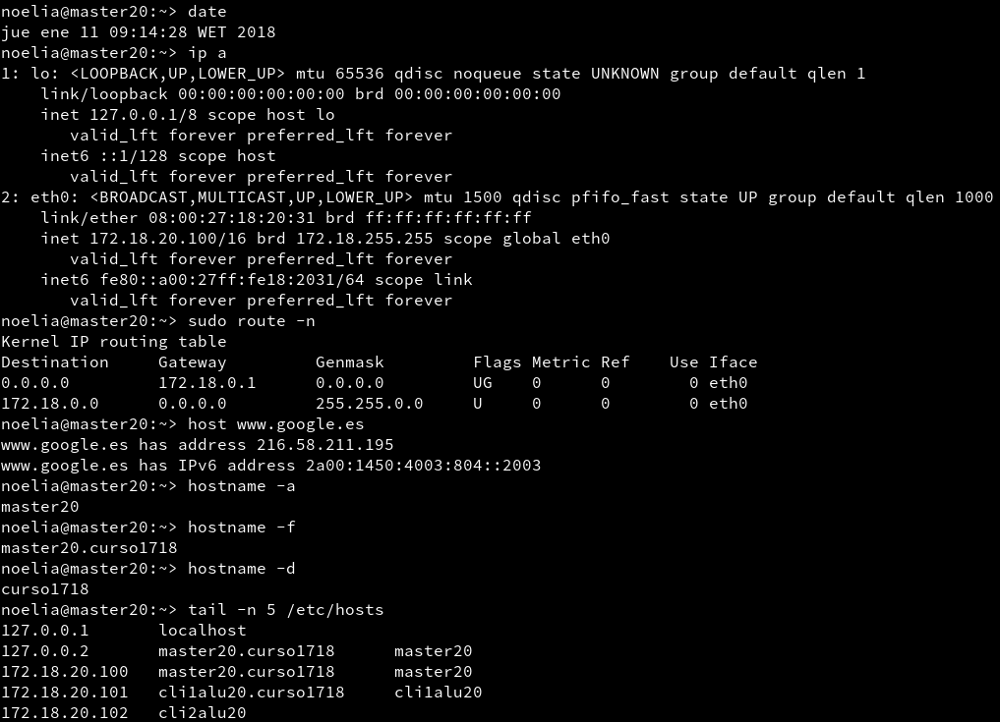

* MV2.

En Windows comprobamos con los siguientes comandos.

~~~
date.
ipconfig.
route PRINT.
nslookup www.google.es.
ping master20.
ping master20.curso1718.
ping cli1alu20.
ping cli1alu20.curso1718.
ping cli2alu20.
~~~

* MV3.

---

# **2. Primera Versión Del Fichero pp.**

Instalamos Puppet Master en la MV master20.

Utilizamos los siguientes comandos.

~~~
systemctl status puppetmaster, consultamos el estado del Servicio.
systemctl enable puppetmaster, permitimos que el Servicio se inicie automáticamente en el inicio de la máquina.
systemctl start puppetmaster, iniciamos el Servicio.
systemctl status puppetmaster, consultamos el estado del Servicio.
~~~

En este momento se ha creado el directorio `/etc/puppet/manifests`.

Preparamos los ficheros/directorios en el Master.

~~~
mkdir `/etc/puppet/files`.
touch `/etc/puppet/files/readme.txt`.
mkdir `/etc/puppet/manifests`.
touch `/etc/puppet/manifests/site.pp`.
mkdir `/etc/puppet/manifests/classes`.
touch `/etc/puppet/manifests/classes/hostlinux1.pp`.
~~~

## **2.1. readme.txt.**

Los ficheros que se guardan en `/etc/puppet/files` se pueden descargar desde el resto de máquinas Cliente puppet.

El contenido para readme.txt es el siguiente.

## **2.2. site.pp.**

`/etc/puppet/manifests/site.pp` es el fichero principal de configuración de órdenes para los agentes/nodos puppet.

El contenido de nuestro site.pp es el siguiente.

## **2.3. hostlinux1.pp.**

Como podemos tener muchas configuraciones, vamos a separarlas en distintos ficheros para organizarnos mejor, y las vamos a guardar en la ruta `/etc/puppet/manifests/classes`.

Vamos a crear una primera configuración para máquina estándar GNU/Linux.

El contenido para `/etc/puppet/manifests/classes/hostlinux1.pp` es el siguiente.

Consultamos los ficheros/directorios que tenemos creado con el comando tree `/etc/puppet`.

 

Comprobamos que tenemos los permisos adecuados en la ruta `/var/lib/puppet`. Esto es, usuario puppet y grupo puppet.

Reiniciamos el Servicio con el comando systemctl restart puppetmaster.

Comprobamos que el Servicio está en ejecución de forma correcta con los siguientes comandos.

~~~
systemctl status puppetmaster.
netstat -ntap | grep ruby.
~~~

Consultamos log por si hay errores con el comando tail `/var/log/puppet/*.log`

Abrimos el cortafuegos para el Servicio.

---

# **3. Instalación Y Configuración Del Cliente1.**

Vamos a instalar y configurar el Cliente 1.

Vamos a la MV Cliente 1.

Instalamos el Agente Puppet.

El Cliente puppet debe ser informado de quien será su master. Para ello, vamos a configurar `/etc/puppet/puppet.conf`.

Comprobamos que tenemos los permisos adecuados en la ruta `/var/lib/puppet`.

Utilizamos los siguientes comandos.

~~~
systemctl status puppet, vemos el estado del Servicio puppet.
systemctl enable puppet, activamos el Servicio en cada reinicio de la máquina.
systemctl start puppet, iniciamos el Servicio puppet.
systemctl status puppet, vemos el estado del Servicio puppet.
netstat -ntap |grep ruby, muestra los Servicios conectados a cada puerto.
~~~

Abrimos el cortafuegos para el Servicio.

---

# **4. Certificados.**

Antes de que el master acepte a Cliente 1 como Cliente, se deben intercambiar los certificados entre ambas máquinas. Esto sólo hay que hacerlo una vez.

## **4.1. Aceptar Certificado.**

Vamos a la MV master.

Consultamos las peticiones pendientes de unión al master con el comando puppet cert list.

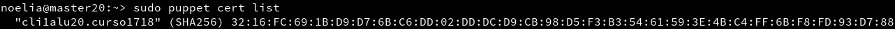

Aceptamos al nuevo Cliente desde el master con el comando puppet cert sign "cli1alu20.curso1718".

## **4.2. Comprobación.**

Vamos a comprobar que las órdenes (manifiesto) del master, llega bien al Cliente y éste las ejecuta.

Vamos a Cliente 1 y reiniciamos la máquina y el Servicio Puppet.

Comprobamos que los cambios configurados en Puppet se han realizado.

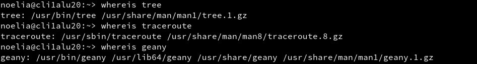

Nos aseguramos de que somos el usuario root y ejecutamos los siguientes comandos para comprobar posibles errores.

~~~
puppet agent --test.
puppet agent --server master20.curso1718 --test.
~~~

Para ver el detalle de los errores, podemos reiniciar el Servicio puppet en el Cliente, y consultamos el archivo de log del Cliente, para ello utilizamos el comando tail `/var/log/puppet/puppet.log`.

# **5. Segunda Versión Del Fichero pp.**

Ya hemos probado una configuración sencilla en PuppetMaster. Ahora vamos a pasar a configurar algo más complejo.

El contenido para `/etc/puppet/manifests/classes/hostlinux2.pp` es el siguiente.

Modificamos `/etc/puppet/manifests/site.pp` para que se use la configuración de hostlinux2 el lugar de la anterior.

El contenido para `/etc/puppet/manifests/site.pp` es el siguiente.

Ejecutamos tree `/etc/puppet` en el Servidor, para comprobar ficheros y directorios.

Reiniciamos el Servicio. Vamos al Cliente 1 y comprobamos que se hayan aplicado los cambios solicitados.

---

# **6. Cliente Puppet Windows.**

Vamos a configurar Puppet para atender también a Clientes Windows.

## **6.1. Modificaciones En El Master.**

Vamos a la MV master.

Vamos a crear una configuración puppet para las máquinas Windows, dentro del fichero.

Creamos `/etc/puppet/manifests/classes/hostwindows3.pp` con el siguiente contenido.

Ahora vamos a modificar el fichero site.pp del master, para que tenga en cuenta la configuración de Clientes GNU/Linux y Clientes Windows, de modo diferenciado, con el siguiente contenido.

Ejecutamos tree `/etc/puppet` para confirmar que tenemos los nuevos archivos.

Reiniciamos el Servicio PuppetMaster.

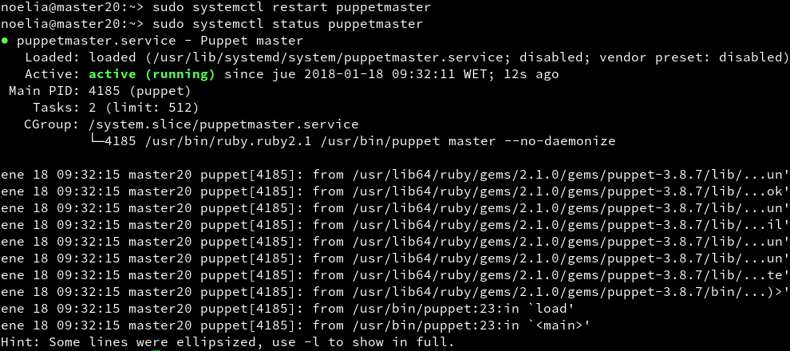

Debemos instalar la misma versión de puppet en master y en los Clientes.

Ejecutamos el comando facter para ver la versión de Puppet que está usando el master.

## **6.2. Modificaciones En El Cliente2.**

Ahora vamos a instalar AgentePuppet en Windows. Recordar que debemos instalar la misma versión en ambos equipos.

Vamos al Cliente Windows.

Descargamos e instalamos la versión de Agente Puppet para Windows similar al Puppet Master.

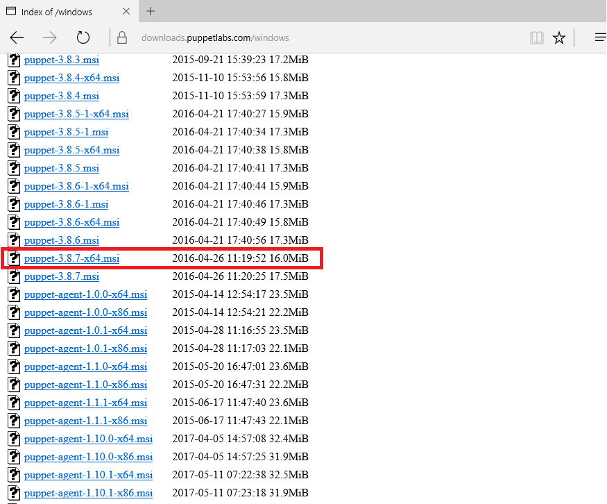

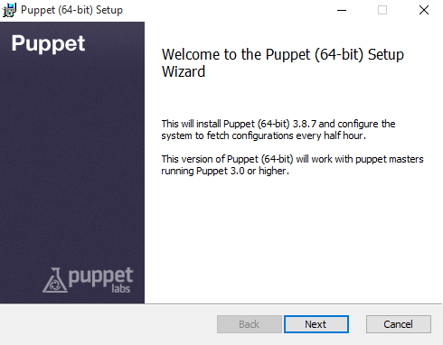

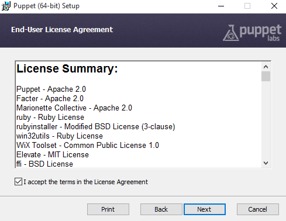

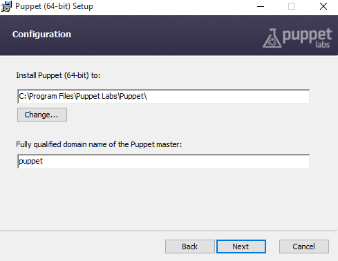

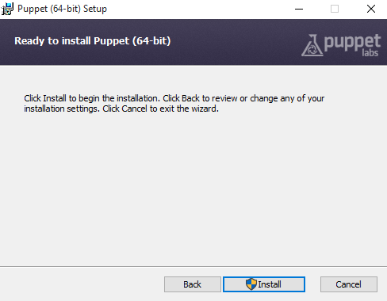

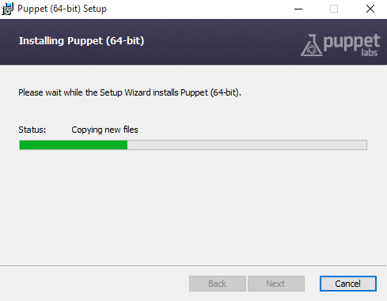

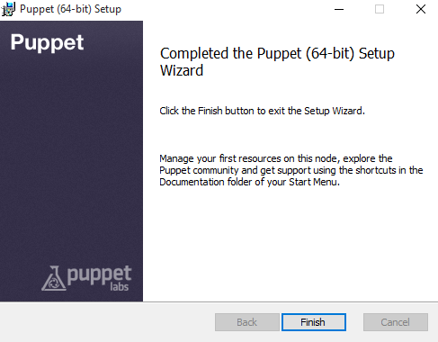

El fichero `puppet.conf` en Windows está en `C:\ProgramData\PuppetLabs\puppet\etc\puppet.conf`. (ProgramData es una ruta oculta). Revisamos que tenga algo como lo siguiente.

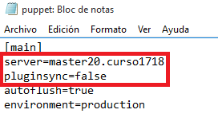

Reiniciamos la MV.

Debemos aceptar el certificado en el master para este nuevo Cliente. Consultamos el apartado 4 y repetimos los pasos para este nuevo Cliente.

En el master no nos aparece el certificado del Cliente Windows para ser aceptado, probamos lo siguiente para conseguir que aparesca.

Vamos a cli2alu20.

Ejecutamos el Agente Puppet y abrimos la Consola Puppet. Ejecutamos puppet agent --server master20.curso1718 --test.

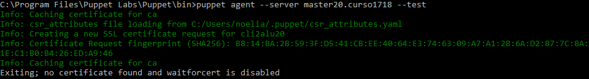

Vamos a master20 y ejecutamos puppet cert list.

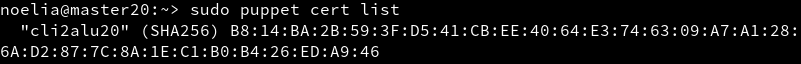

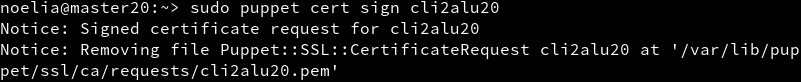

## **6.3. Comprobamos Los Cambios.**

Vamos al Cliente 2.

Con los comandos siguientes podremos hacernos una idea de como terminar de configurar el fichero puppet del master para la máquina Windows.

Iniciamos la consola puppet como administrador y probamos los comandos.

~~~
puppet agent --configprint server, debe mostrar el nombre del Servidor puppet. En nuestro ejemplo debe ser master20.curso1718.
puppet agent --server master20.curso1718 --test, comprobamos el estado del agente puppet.
~~~

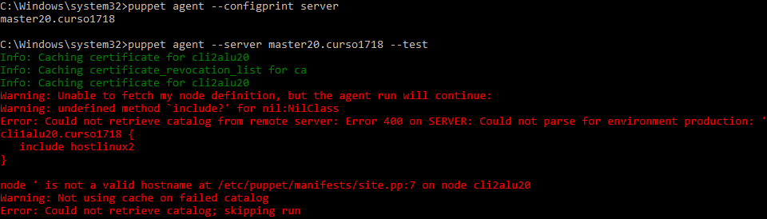

Si tenemos problemas con el certificado de la máquina Windows Cliente tenemos que seguir los siguientes pasos para eliminar cualquier rastro de los mismos y poder reintentar la comunicación.

Borramos en el maestro el certificado correspondiente a esa máquina puppet cert clean cli2alu20.

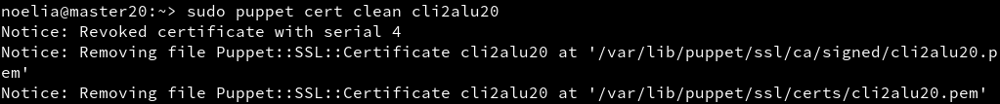

Desinstalamos el agente puppet en Windows y borramos las carpetas de datos del puppet, ya que no se borran en la desinstalación. Las carpetas son las siguientes.

~~~
`C:\ProgramData\PuppetLabs` y `C:\Users\usuario\.puppet`.
~~~

Después reinstalamos el agente puppet en Windows como podemos ver en el apartado 6.2.

Ahora debemos aceptar el certificado en el master para este nuevo Cliente. Consultamos el apartado 4 y repetimos los pasos para este nuevo Cliente.

En el master no nos aparece el certificado del Cliente Windows para ser aceptado, probamos lo siguiente para conseguir que aparesca.

Vamos a cli2alu20.

Ejecutamos el Agente Puppet y abrimos la Consola Puppet. Ejecutamos puppet agent --server master20.curso1718 --test.

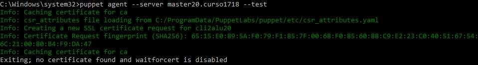

Vamos a master20 y ejecutamos puppet cert list.

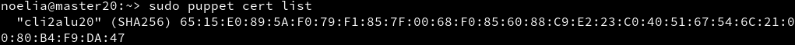

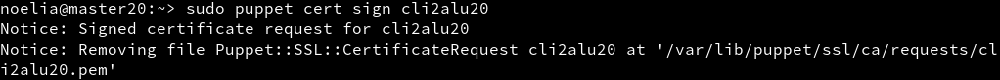

Vamos al Cliente 2.

Con los comandos siguientes podremos hacernos una idea de como terminar de configurar el fichero puppet del master para la máquina Windows.

Iniciamos la consola puppet como administrador y probamos los comandos.

~~~
puppet agent --configprint server, debe mostrar el nombre del Servidor puppet. En nuestro ejemplo debe ser master20.curso1718.
puppet agent --server master20.curso1718 --test, comprobamos el estado del agente puppet.
puppet agent -t --debug --verbose, comprobamos el estado del agente puppet.
facter, para consultar datos de la máquina windows, como por ejemplo la versión de puppet del Cliente.
puppet resource user noelia, para ver la configuración puppet del usuario.
puppet resource file c:\Users, para ver la configuración puppet de la carpeta.
~~~

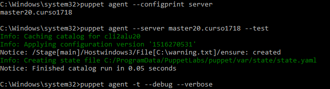

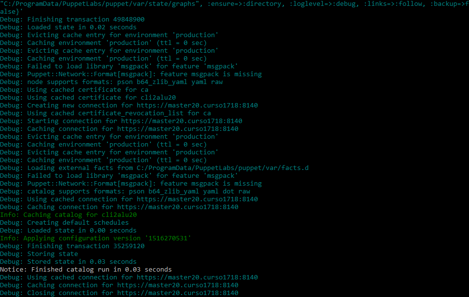

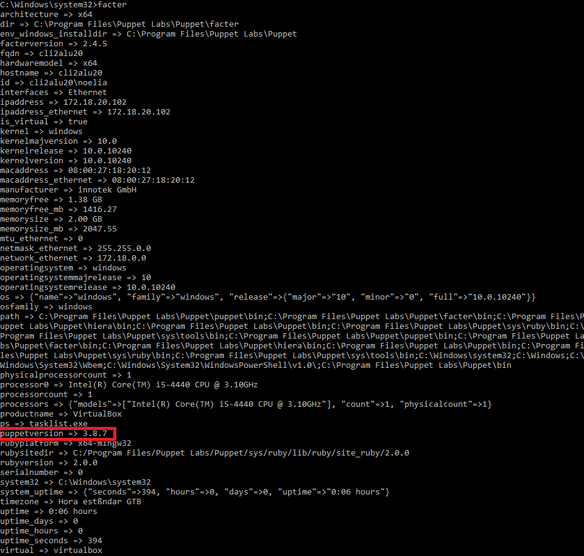

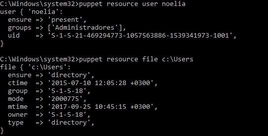

---

# **7. Configuración hostwindows4.pp Y Configuración Personalizada: hostalumno5.pp.**

Configuramos en el master el fichero `/etc/puppet/manifests/classes/hostwindows4.pp` para el Cliente Windows.

El contenido de `/etc/puppet/manifests/classes/hostwindows4.pp` es el siguiente.

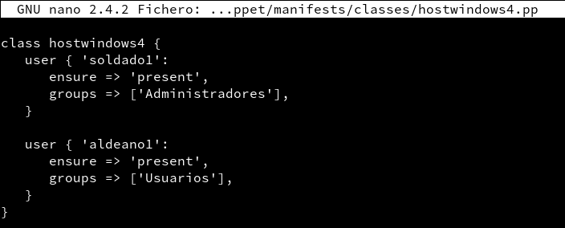

Creamos un nuevo fichero de configuración para la máquina cliente Windows con el nombre `/etc/puppet/manifests/classes/hostalumno5.pp`.

El contenido de `/etc/puppet/manifests/classes/hostalumno5.pp` es el siguiente.

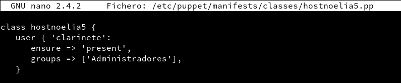

Incluimos configuraciones elegidas.

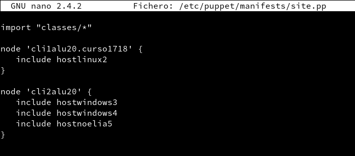

Comprobamos que todo se ha realizado correctamente.

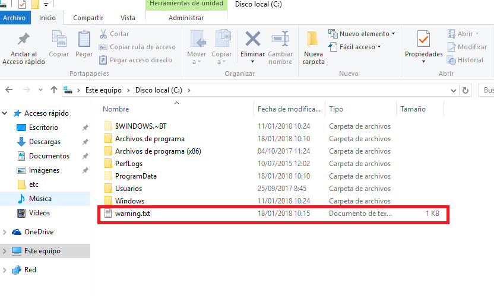

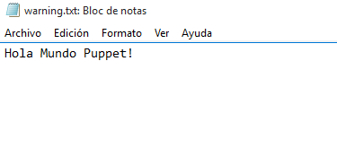

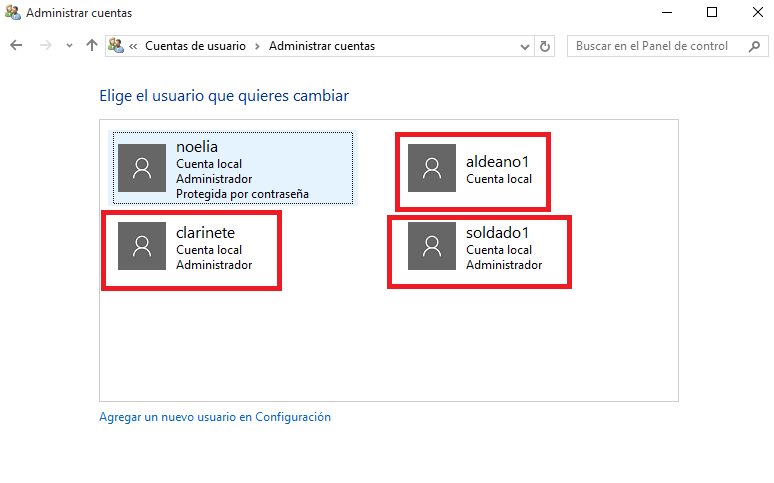

---
