___

# **Tareas Programadas.**

---

# **1. Windows.**

Vamos a hacer una tarea diferida y una tarea periódica con Windows.

En Windows 10 para abrir el programador de tareas iremos a Panel de control -> Herramientas administrativas -> Programador de tareas.

## **1.1. Tarea Diferida.**

La tarea diferida se define para ejecutarse una sola vez en una fecha futura.

Vamos a programar una tarea diferida para que nos permita abrir un fichero de texto en pantalla.

Realizamos una tarea básica. Le ponemos un nombre a la tarea, como por ejemplo, Tarea Hola Mundo.

Queremos que se realice una vez.

Añadimos la fecha y hora a la que queremos que se realice la tarea.

Queremos que se inicie un programa.

Dicho programa es un documento TXT con el siguiente contenido.

Ese documento TXT lo ponemos en nuestra tarea.

Nos muestra un resumen de nuestra tarea.

Finalmente tenemos nuestra tarea hecha.

Cuando sea la hora correspondiente a la tarea nos saldrá un fichero de texto en pantalla.

## **1.2. Tarea Periódica.**

La tarea periódica se define para ejecutarse periódicamente cada intervalo de tiempo.

Vamos a programar una tarea periódica para apagar el equipo.

Realizamos una tarea básica. Le ponemos un nombre a la tarea, como por ejemplo, Tarea Shutdown.

Queremos que se realice diariamente.

Añadimos la fecha y hora a la que queremos que se realice la tarea y también cada cuantos días queremos que se repita.

Queremos que se inicie un programa.

Dicho programa es un script con el siguiente contenido.

Ese script lo ponemos en nuestra tarea.

Nos muestra un resumen de nuestra tarea.

Finalmente tenemos nuestra tarea hecha.

Cuando sea la hora correspondiente a la tarea nos saldrá un mensaje y se apagará el equipo.

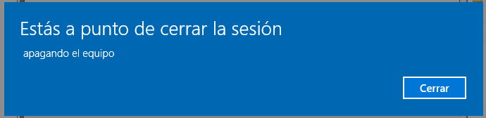

---

# **2. SO GNU/Linux.**

Vamos a hacer una tarea diferida y una tarea periódica con GNU/Linux.

## **2.1. Tarea Diferida.**

Programamos una tarea diferida, con el comando at, que nos muestre un mensaje en pantalla.

El servicio atd es el responsable de la ejecución de los comandos at. Para asegurarnos de que esté en ejecución hacemos lo siguiente.

Vamos a Yast y entramos en Servicios.

Comprobamos que atd esta inhabilitado e inactivo.

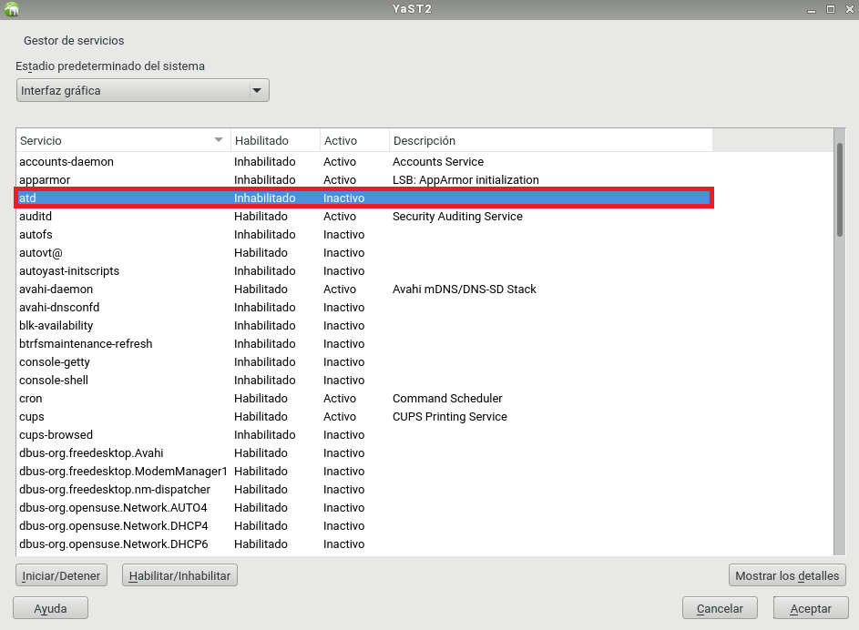

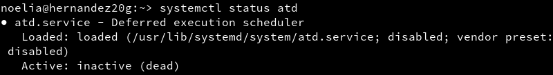

Lo que tenemos que hacer es poner atd habilitado y activo.

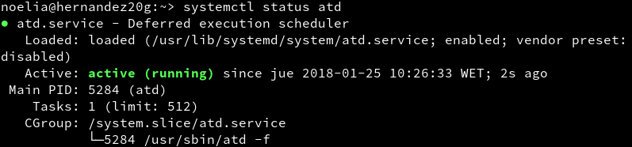

Configuramos nuestro usuario para que pueda ejecutar el comando at.

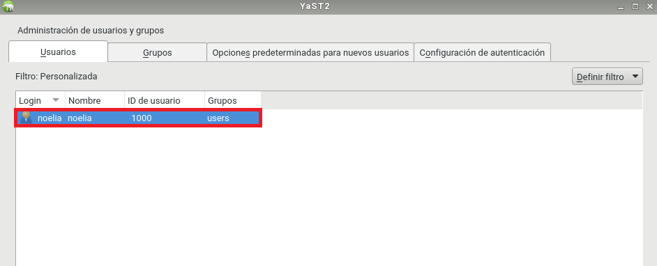

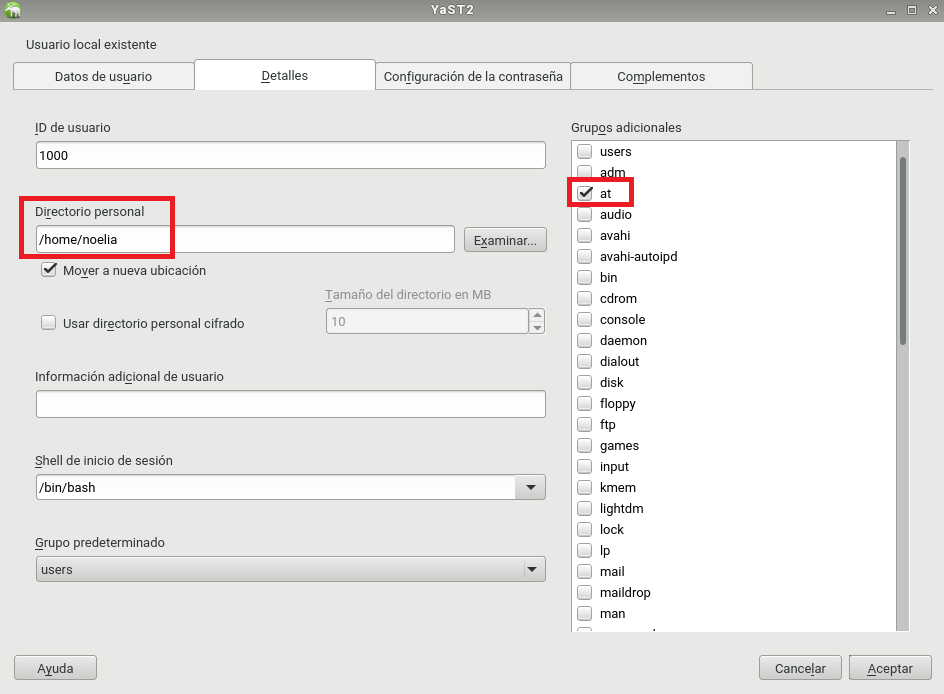

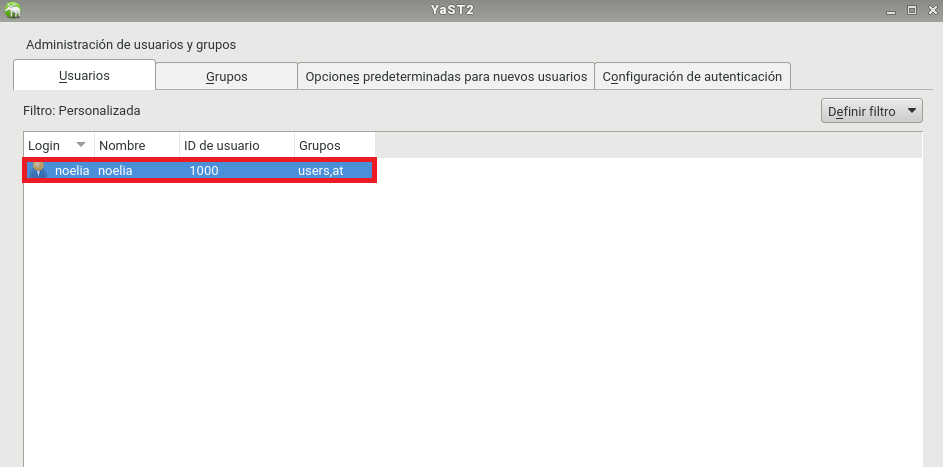

Si el usuario no tuviera permisos para ejecutar at, consultamos los ficheros `/etc/at.deny` y `/etc/at.allow`.

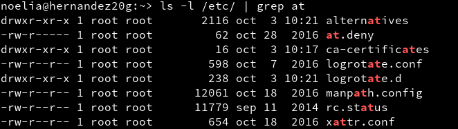

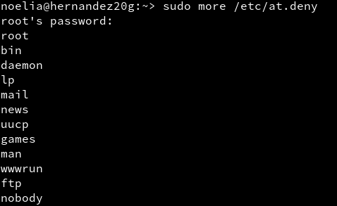

Creamos un script para que nos muestre un mensaje en pantalla.

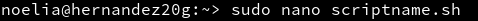

El contenido del script es el siguiente.

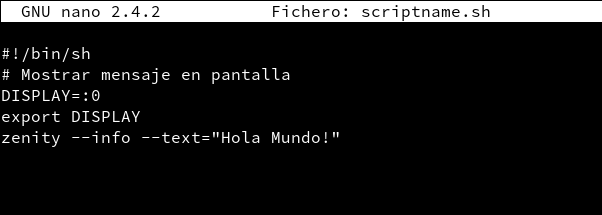

Instalamos zenity con el comando zypper install zenity.

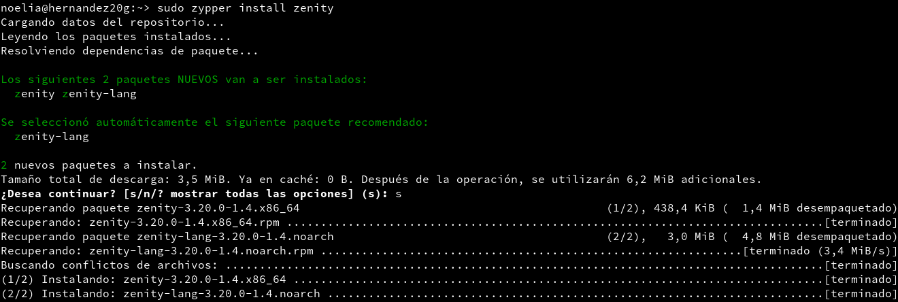

Utilizamos el comando atq para comprobar que no hay ningún trabajo. Usamos el comando `at 11:26 Jan 25 < scriptname.sh` para programar una tarea diferida. Volvemos a utilizar el comando atq y vemos que hay una tarea diferida.

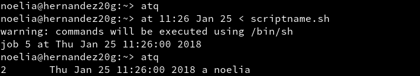

Vemos que nos sale el mensaje en pantalla.

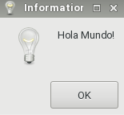

Volvemos a utilizar el comando atq para ver que no hay trabajos en cola.

## **2.2. Tarea Periódica.**

Programamos una tarea periódica, con el comando crontab, que nos almacene las fechas en un documento.

Para consultar que no hay tareas programadas utilizamos el comando crontab -l.

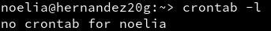

Para abrir el editor para crear una nueva tarea periódica utilizamos el comando crontab -e.

El contenido de la nueva tarea es el siguiente.

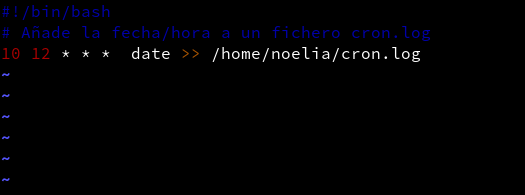

Para consultar la tarea que tenemos programada utilizamos el comando crontab -l.

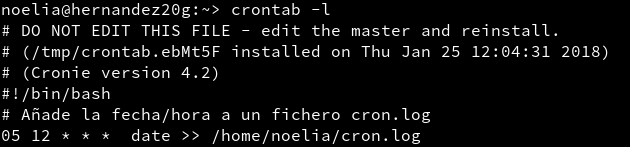

La tarea nos guarda en `cron.log` la información que almacena y dicha información es la siguiente.

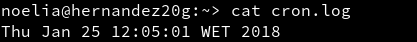

---
