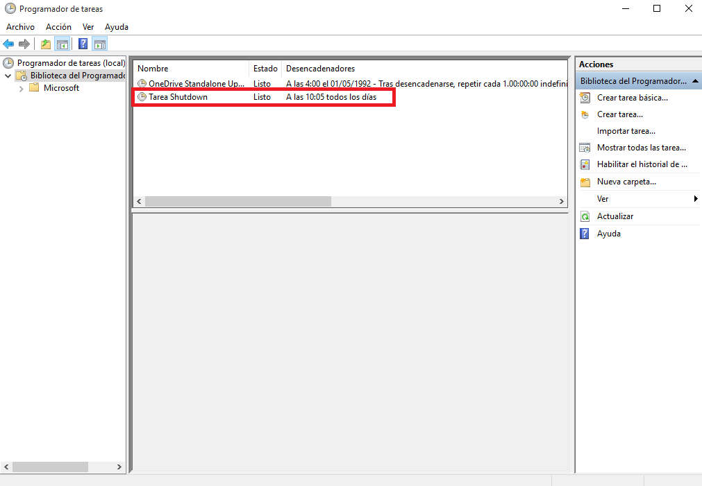

___

# **Tareas Programadas.**

---

# **1. Windows.**

Vamos a hacer una tarea diferida y una tarea periódica con Windows.

En Windows 10 para abrir el programador de tareas iremos a Panel de control -> Herramientas administrativas -> Programador de tareas.

## **1.1. Tarea Diferida.**

La tarea diferida se define para ejecutarse una sola vez en una fecha futura.

Vamos a programar una tarea diferida para que nos permita abrir un fichero de texto en pantalla.

Realizamos una tarea básica. Le Ponemos el nombre a la tarea, como por ejemplo, Tarea Hola Mundo.

Queremos que se realice una vez.

Añadimos la fecha y hora de cuando queremos que se realice la tarea.

Queremos que se inicie un programa.

Dicho programa es un mensaje que saldrá en un documento TXT con el siguiente contenido.

Ese documento TXT lo ponemos en nuestra tarea.

Finalmente tenemos nuestra tarea hecha.

## **1.2. Tarea Periódica.**

La tarea programada se define para ejecutarse periódicamente cada intervalo de tiempo.

Vamos a programar una tarea periódica para apagar el equipo.

Realizamos una tarea básica. Le Ponemos el nombre a la tarea, como por ejemplo, Tarea Shutdown.

Queremos que se realice diariamente.

Añadimos la fecha y hora de cuando queremos que se realice la tarea.

Queremos que se inicie un programa.

Dicho programa es un scrip con el siguiente contenido.

Ese scrip lo ponemos en nuestra tarea.

Finalmente tenemos nuestra tarea hecha.

---

# **2. SO GNU/Linux.**

Vamos a hacer una tarea diferida y una tarea periódica con GNU/Linux.

## **2.1. Tarea Diferida.**

El servicio atd es el responsable de la ejecución de los comandos at. Para asegurarnos de que esté en ejecución hacemos lo siguiente.

~~~
Yast -> Servicios.
systemctl status atd.
~~~

Configuramos nuestro usuario para que pueda ejecutar el comando at.

Si el usuario no tuviera permisos para ejecutar at, consultamos los ficheros: `/etc/at.deny` y `/etc/at.allow`.

Vamos a programar una tarea diferida, comando at, que nos muestre un mensaje en pantalla.

Creamos un script que muestra un mensaje de aviso.

El contenido del script es el siguiente.

Instalamos zenity con el comando zypper install zenity.

Utilizamos el comando atq para comprobar que no hay ningún trabajo. Usamos el comando at 11:26 Jan 25 < scriptname.sh para programar una tarea diferida. Volvemos a utilizar el comando atq y vemos que hay una tarea diferida.

Vemos que nos sale el mensaje por pantalla.

Volvemos a utilizar el comando atq para que nos muestre que no hay trabajos en cola.

## **2.2. Tarea Periódica.**

Programamos una tarea periódica (crontab) que nos almacenara las fechas en un documento.

Definir una tarea periódica (crontab) para apagar el equipo todos los días a una hora/minuto determinada.

Para programar una tarea periódica tenemos estas formas.

Los usuarios usan el comando crontab para programar sus tareas.

El usuario root usa el fichero `/etc/crontab` para programar las tareas del sistema.

crontab -l, para consultar que no hay tareas programadas.

crontab -e, abre el editor para crear una nueva tarea periódica.

El contenido es el siguiente.

crontab -l, para consultar la tarea que tenemos programada.

Lo que se realizo se guarda en el siguiente fichero.

---
