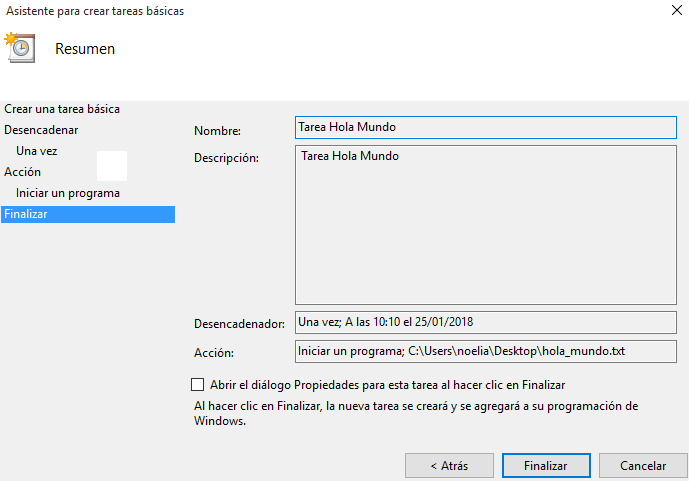
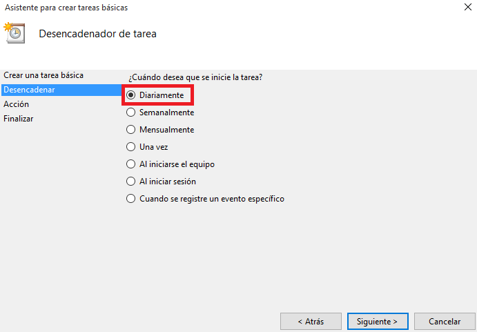
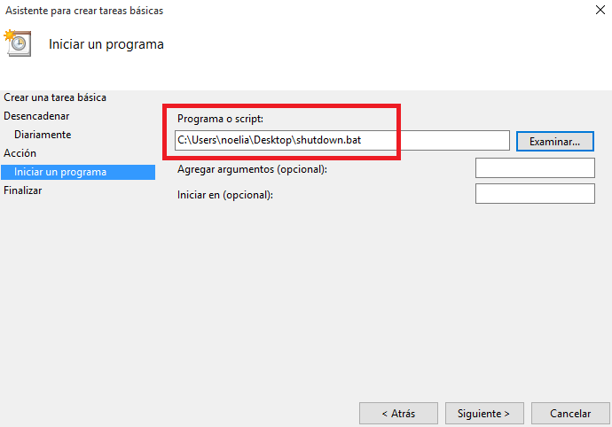
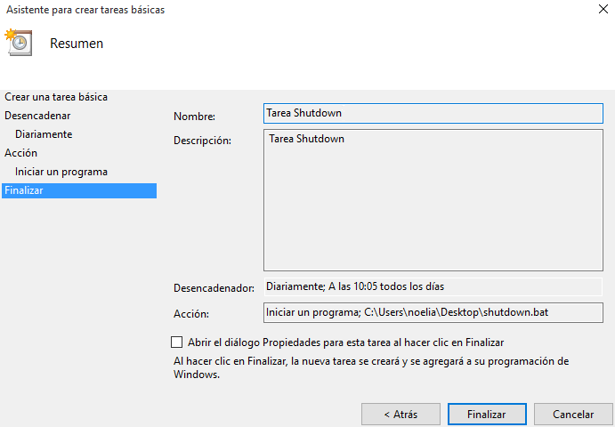

___

# **Tareas Programadas.**

---

# **1. Windows.**

Vamos a hacer una tarea programada y una tarea diferida con Windows.

En Windows 10 para abrir el programador de tareas hacemos Panel de control -> Herramientas administrativas -> Programador de tareas.

## **1.1. Tarea Diferida.**

La tarea diferida se define para ejecutarse una sola vez en una fecha futura.

Vamos a programar una tarea diferida para que nos muestre un mensaje en pantalla.

## **1.2. Tarea Periódica.**

La tarea programada se define para ejecutarse periódicamente cada intervalo de tiempo.

Vamos a programar una tarea periódica para que nos muestre un mensaje en pantalla.

---

# **2. SO GNU/Linux.**

Vamos a hacer una tarea programada y una tarea diferida con GNU/Linux.

## **2.1. Tarea Diferida.**

Configurarmos nuestro usuario para que pueda ejecutar el comando at.

Vamos a programar una tarea diferida (comando at) que nos mostrará un mensaje en pantalla.

~~~
at, crea una tarea diferida.
atq, muestra los trabajos en cola.
at -c 1, muestra la configuración del trabajo ID=1.
atrm 1, elimina el trabajo con ID=1.
~~~

El servicio atd es el responsable de la ejecución de los comandos at. Para asegurarnos de que esté en ejecución.

~~~
Yast -> Servicios.
systemctl status atd.
~~~

Si el usuario no tuviera permisos para ejecutar at, consultamos los ficheros: `/etc/at.deny` y `/etc/at.allow`.

## **2.2. Tarea Periódica.**

Programamos una tarea periódica (crontab) que nos almacenara las fechas en un documento.

Para programar una tarea periódica tenemos estas formas.

Los usuarios usan el comando crontab para programar sus tareas.

El usuario root usa el fichero `/etc/crontab` para programar las tareas del sistema.

---
